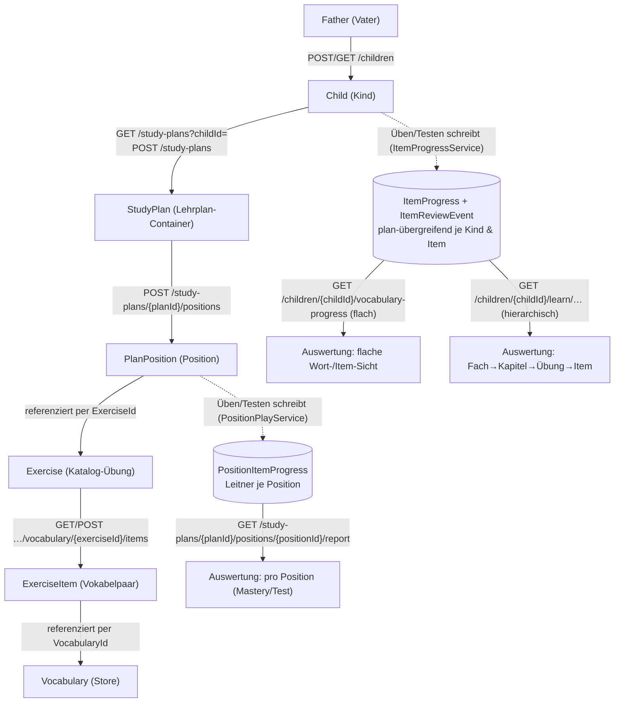

# Endpunkt-Beziehungen: Übung → Lehrplan → Kind → Auswertung

Diese Seite verknüpft die Endpunkte **inhaltlich** – nicht als flacher Index (den gibt es in
[wiki/07 · API-Referenz](../wiki/07-api-referenz.md)), sondern als **Landkarte, wie sie aufeinander
aufbauen**: Welche Ressource entsteht woraus, worüber wird sie verknüpft, und wo liest man den
Lernstand wieder aus. Alle Routen unter `api/v1/…`. Konzept-Hintergrund:
[wiki/01 · Überblick & Architektur](../wiki/01-ueberblick-architektur.md).

---

## Die Kette auf einen Blick

**Kurzfassung:** Der Vater pflegt **einmal** globale Katalog-Übungen. Ein **Lehrplan** gehört einem
**Kind** und referenziert über **Positionen** diese Übungen (kopiert sie nicht). Beim **Üben/Testen**
bewertet der Server und schreibt zwei parallele Fortschritts-Spuren. Die **Auswertung** liest diese
Spuren aus drei Blickwinkeln.

---

## 1. Übung ↔ Lehrplan (über Positionen)

Der Katalog ist **global und kindneutral**; der Lehrplan verweist nur darauf.

| Beziehung | Endpunkt(e) | Wohin |
| --- | --- | --- |
| Katalog-Übung anlegen/ändern (je Typ) | `GET/POST/PUT/DELETE /learn/subjects/{s}/chapters/{c}/<typ>[/{id}]` | [ExerciseControllers.cs](../backend/Pugling.Api/Controllers/Learn/ExerciseControllers.cs) |
| Passende Übung finden | `GET /learn/exercises?subjectId=&grade=&schoolType=&categoryId=&type=&search=` | [ExerciseCatalogController.cs](../backend/Pugling.Api/Controllers/Learn/ExerciseCatalogController.cs) |
| Übung **in den Plan hängen** (Position) | `GET/POST /study-plans/{planId}/positions` · `GET/PATCH/DELETE …/{positionId}` | [PlanPositionsController.cs](../backend/Pugling.Api/Controllers/Learn/PlanPositionsController.cs) |
| Vokabelpaare der Übung | `GET/POST …/vocabulary/{exerciseId}/items` · `…/items/{itemId}` | [ExerciseControllers.cs](../backend/Pugling.Api/Controllers/Learn/ExerciseControllers.cs) |

**Verknüpfung:** `PlanPosition.ExerciseId → Exercise.Id`. Der Inhalt bleibt in der Übungs-Config; die
Position trägt nur Ziel, Punkte, Stufe, Leitner (leere Overrides erben die Übungs-Defaults).
→ [wiki/04 · Lernplan bauen](../wiki/04-lernplan-bauen.md).

> ⚠️ Eine Übung wird **nicht kopiert**. Ändert man ihre Items, während sie in einem Plan liegt, sind
> index-verschiebende Mutationen gesperrt (`409 exercise_in_use`); Anhängen ist erlaubt. Löschen einer
> genutzten Übung ist gesperrt. Siehe [Auswertung](#3-übung--auswertung-des-kindes) zur Robustheit.

## 2. Lehrplan ↔ Kind

| Beziehung | Endpunkt(e) | Wohin |
| --- | --- | --- |
| Kinder des Vaters | `GET/POST /children` · `GET/PATCH/DELETE /children/{childId}` | [ChildrenController](../backend/Pugling.Api/Controllers/Admin/ChildrenController.cs) |
| Pläne eines Kindes | `GET /study-plans?childId=` · `GET /study-plans/{planId}` | [StudyPlansController.cs](../backend/Pugling.Api/Controllers/Learn/StudyPlansController.cs) |
| Plan anlegen/ändern | `POST /study-plans` · `PATCH /study-plans/{planId}` | [StudyPlansController.cs](../backend/Pugling.Api/Controllers/Learn/StudyPlansController.cs) |

**Verknüpfung:** `StudyPlan.ChildId → Child.Id`. Damit ist jeder Zustand automatisch **pro Kind
isoliert**. Eigentum erzwingen die Filter [`PlanOwnershipFilter`](../backend/Pugling.Api/Auth/PlanOwnershipFilter.cs)
(unter `{planId}`) und [`ChildOwnershipFilter`](../backend/Pugling.Api/Auth/ChildOwnershipFilter.cs)
(unter `{childId}`): Vater = eigene Kinder, Sohn = er selbst. → [wiki/02 · Auth & Rollen](../wiki/02-authentifizierung.md).

Genau **ein aktiver + laufender** Plan je Kind ist spielbar (Anti-Cheat); deaktivierte Pläne bleiben
zur Auswertung erhalten (`StudyPlan.Active`).

## 3. Übung ↔ Auswertung des Kindes

Beim **Üben/Testen** (server-autoritativ) entstehen **zwei parallele Fortschritts-Spuren** aus denselben
Antworten:

| Spur | Womit geschrieben | Schlüssel | Zweck |
| --- | --- | --- | --- |
| **`PositionItemProgress`** | [PositionPlayService](../backend/Pugling.Api/Services/PositionPlayService.cs) | `(PlanPositionId, ItemIndex)` | Leitner-Terminierung **innerhalb einer Plan-Position** |
| **`ItemProgress` + `ItemReviewEvent`** | [ItemProgressService](../backend/Pugling.Api/Services/ItemProgressService.cs) | `(ChildId, ItemId)`, denorm. `ExerciseId`/`VocabularyId` | **plan-übergreifender** Stand je Item + Wort + Historie |

Geschrieben werden sie an denselben Bewertungspunkten:
`POST …/positions/{positionId}/practice-sessions/{sid}/review`
([PositionPracticeController](../backend/Pugling.Api/Controllers/Learn/PositionPracticeController.cs)) und
`POST …/positions/{positionId}/tests/{attemptId}/submit`
([PositionTestsController](../backend/Pugling.Api/Controllers/Learn/PositionTestsController.cs)).

Daraus ergeben sich **drei Auswertungs-Blickwinkel**:

### a) Pro Position (im Plan-Kontext)

| Endpunkt | Wohin |
| --- | --- |
| `GET /study-plans/{planId}/overview` · `…/overview/progress` | [PlanOverviewController](../backend/Pugling.Api/Controllers/Learn/PlanOverviewController.cs) → [PositionProgressService](../backend/Pugling.Api/Services/PositionProgressService.cs) |
| `GET /study-plans/{planId}/positions/{positionId}/report` | [PositionReportController](../backend/Pugling.Api/Controllers/Learn/PositionReportController.cs) → [PositionReportService](../backend/Pugling.Api/Services/PositionReportService.cs) |

Antwort auf „welche Vokabel dieser **Position** sitzt?" plus Tagesmission/Streak. Liest `PositionItemProgress`.

### b) Kind-zentrisch, flach (übergreifend)

| Endpunkt | Wohin |
| --- | --- |
| `GET /children/{childId}/vocabulary-progress` (`?exerciseId=&maxBox=&onlyWeak=`) | [ChildVocabularyProgressController](../backend/Pugling.Api/Controllers/Learn/ChildVocabularyProgressController.cs) |
| `GET …/vocabulary-progress/{itemId}` · `…/{itemId}/history` · `…/by-word` | dito |

Antwort auf „welche **Wörter** sitzen bei diesem Kind – egal in welcher Übung?" (Wort-Rollup, Historie,
schlecht gelernte Wörter). Liest `ItemProgress`/`ItemReviewEvent`.

### c) Kind-zentrisch, hierarchisch (Drill-down) — spiegelt den Katalog

| Endpunkt | Inhalt |
| --- | --- |
| `GET /children/{childId}/learn/subjects` | Fächer + Aggregat |
| `GET …/subjects/{subjectId}` | ein Fach |
| `GET …/subjects/{subjectId}/chapters` | Kapitel + Aggregat |
| `GET …/subjects/{subjectId}/chapters/{chapterId}/vocabulary` | Übungen + Fortschritt je Übung |
| `GET …/vocabulary/{exerciseId}/items` | Item-Lernstand (schwächste zuerst) |

→ [ChildLearnProgressController](../backend/Pugling.Api/Controllers/Learn/ChildLearnProgressController.cs)
/ [ChildLearnProgressService](../backend/Pugling.Api/Services/ChildLearnProgressService.cs). Antwort auf
„wie steht das Kind **je Fach/Kapitel/Übung** da?" – die Grundlage, um **Ziele festzulegen**. Alle Listen
unterstützen `?search=`, `?sort=`+`?dir=`, `?active=` und Paging (`skip`/`take` + Header `X-Total-Count`).

**Robustheit gegen Änderungen/Löschen (b & c):** Angezeigt wird die **relevante Menge = zugewiesen ∪ hat
Fortschritt**. Wird eine Übung abgehängt oder ihr Plan deaktiviert, **verschwindet der Fortschritt nicht** –
sie bleibt mit **`active: false`** sichtbar. `ItemProgress` kann keine gelöschte Übung überdauern (Cascade
über `ExerciseItem`), daher gibt es keine „toten" Fortschrittszeilen; eine hart gelöschte Übung lebt nur
noch im Wort-Rollup der flachen Sicht (`ItemReviewEvent` mit denormalisierter `VocabularyId`) weiter.

## 4. Lernziele: Ergebnis-Ziele auf der Auswertung

Der Vater setzt **Beherrschungs-/Abdeckungsziele** je Kind auf einem Katalog-Scope (Fach/Kapitel/Übung);
der Status (`open` / `achieved` / `overdue`) wird **live** aus denselben Aggregaten wie in §3 berechnet –
kein materialisierter Zustand, keine Belohnung (v1). Plan-übergreifend: das Ziel hängt am Kind + Scope
(nicht an einer Position) und überlebt das Abhängen einer Übung.

| Endpunkt | Wohin |
| --- | --- |
| `GET/POST /children/{childId}/learn-goals` · `GET/PATCH/DELETE …/{goalId}` | [LearnGoalsController](../backend/Pugling.Api/Controllers/Learn/LearnGoalsController.cs) → [LearnGoalService](../backend/Pugling.Api/Services/LearnGoalService.cs) |

- **Metriken** bilden direkt Felder des `MasteryRollup` (§3) ab: `AvgMastery`, `Coverage`,
  `MasteredPercent` (jeweils „≥ Zielwert") und `MaxWeakItems` („≤ Zielwert").
- **Lesen**: Vater **und** Kind (Motivation); **Schreiben**: nur Vater. Filter `?subjectId=`/`?status=`.
- **Abgrenzung:** das plan-gebundene Pflicht-Ziel der Position (`GoalCadence`, Tag/Woche) und die
  aktivitätsbasierten [Missionen](../wiki/05-punkte-und-bonus.md) sind eigene Konzepte – Lernziele messen
  den **Lernstand** (Ergebnis), nicht die Aktivität.

## 5. Was der Fortschritt auslöst: Punkte & Gamification

| Beziehung | Endpunkt(e) | Wohin |
| --- | --- | --- |
| Punkte-Ledger des Kindes | `GET/POST /children/{childId}/points` · `GET /me/points[/entries]` | [ScoringService](../backend/Pugling.Api/Services/ScoringService.cs), → [wiki/05 · Punkte](../wiki/05-punkte-und-bonus.md) |
| Missionen/Auszeichnungen (Vater def., Sohn sieht) | `…/children/{childId}/missions\|achievements` · `/me/missions\|achievements` | [GamificationService](../backend/Pugling.Api/Services/GamificationService.cs) |

Jede bewertete Antwort bucht Punkte (Basis × Zeitfenster + Boni) und wertet Missionen/Auszeichnungen
idempotent aus – gespeist aus denselben Fortschrittsdaten.

---

## Der Loop als Endpunkt-Sequenz

1. **Vater – Katalog:** `POST /learn/subjects` → `…/chapters` → `…/chapters/{c}/vocabulary` (+ `…/items`).
2. **Vater – Plan fürs Kind:** `POST /study-plans` (`childId`) → `POST /study-plans/{planId}/positions` (`exerciseId`).
3. **Sohn – üben/testen:** `…/overview` → `…/practice-sessions` → `…/review` → `…/tests` → `…/submit`.
4. **Auswertung:** pro Position `…/positions/{positionId}/report`; kind-zentrisch
   `children/{childId}/vocabulary-progress` (flach) bzw. `children/{childId}/learn/…` (hierarchisch, für Ziele).

Vollständige Beispiel-Requests: [wiki/04 · Lernplan bauen](../wiki/04-lernplan-bauen.md) (Vater),
[wiki/06 · Sohn-App](../wiki/06-sohn-app.md) (Sohn); verifizierte Responses unter
[docs/api-examples/](api-examples/index.md).
