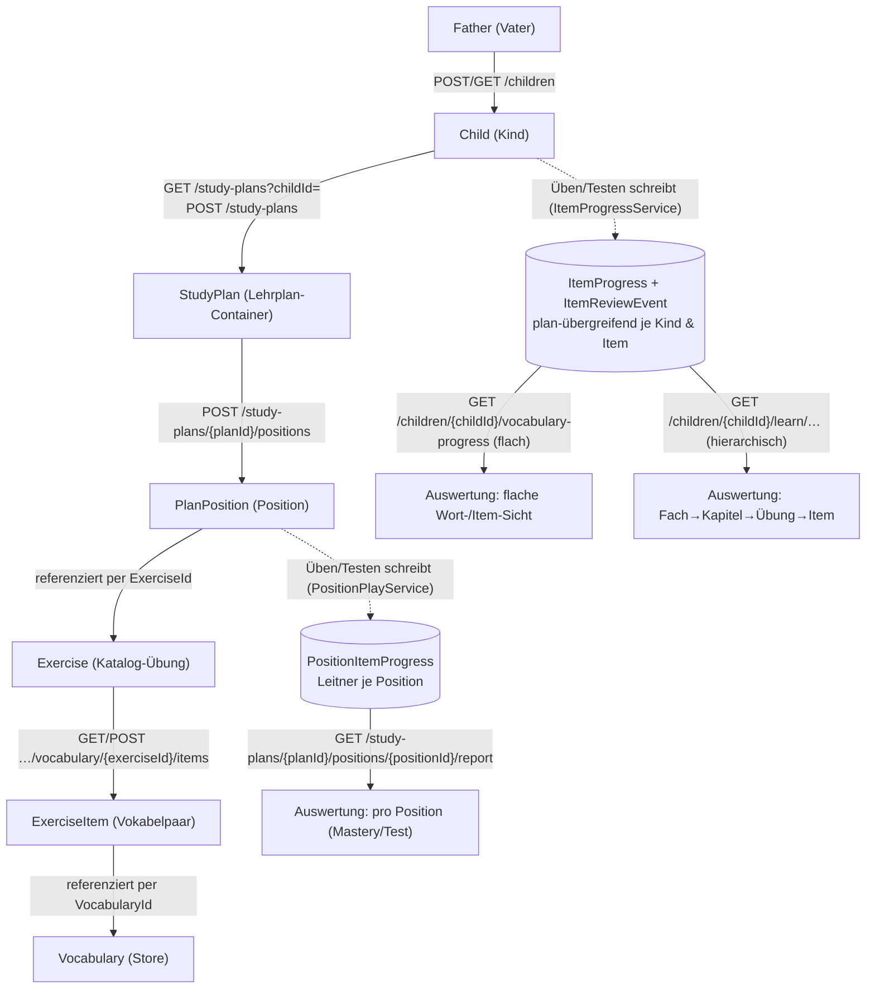

# Endpunkt-Beziehungen: Übung → Lehrplan → Kind → Auswertung

Diese Seite verknüpft die Endpunkte **inhaltlich** – nicht als flacher Index (den gibt es in
[wiki/07 · API-Referenz](../wiki/07-api-referenz.md)), sondern als **Landkarte, wie sie aufeinander
aufbauen**: Welche Ressource entsteht woraus, worüber wird sie verknüpft, und wo liest man den
Lernstand wieder aus. Alle Routen unter `api/v1/…`. Konzept-Hintergrund:
[wiki/01 · Überblick & Architektur](../wiki/01-ueberblick-architektur.md).

## Navigierbare Einstiegspunkte

- [Die Kette auf einen Blick](#die-kette-auf-einen-blick) – Ressource-zu-Ressource-Diagramm.
- [Übung ↔ Lehrplan](#1-übung--lehrplan-über-positionen) – warum Pläne Übungen referenzieren statt kopieren.
- [Lehrplan ↔ Kind](#2-lehrplan--kind) – `StudyPlan.ChildId`, Rollenfilter und spielbarer Plan.
- [Durchstich Vater→Sohn](#durchstich-vater-weist-zu--sohn-sieht-denselben-plan) – konkrete Request/Response-Kette.
- [Übung ↔ Auswertung](#3-übung--auswertung-des-kindes) – positionsgebundener und kindweiter Lernstand.
- [Lernziele](#4-lernziele-ergebnis-ziele-auf-der-auswertung) – Vater-Ziele auf Live-Auswertung.
- [Punkte & Gamification](#5-was-der-fortschritt-auslöst-punkte--gamification) – Punkte, Missionen, Auszeichnungen.
- [Weitere Vater→Sohn-Zusammenhänge](#6-weitere-vatersohn-zusammenhänge) – Lernziele, Missionen, Rewards, Shop, nächste Planung.

Obsidian-Hinweis: Die Produkt-Doku nutzt bewusst relative Markdown-Links statt `[[Wikilinks]]`
(siehe [Obsidian-Konvention](obsidian.md#leitplanken-verbindlich)). Obsidian indiziert diese Links trotzdem
für Backlinks und Graph; auf GitHub bleiben sie gleichzeitig korrekt klickbar.

---

## Die Kette auf einen Blick



**Kurzfassung:** Der Vater pflegt **einmal** globale Katalog-Übungen. Ein **Lehrplan** gehört einem
**Kind** und referenziert über **Positionen** diese Übungen (kopiert sie nicht). Beim **Üben/Testen**
bewertet der Server und schreibt zwei parallele Fortschritts-Spuren. Die **Auswertung** liest diese
Spuren aus drei Blickwinkeln.

---

## 1. Übung ↔ Lehrplan (über Positionen)

Der Katalog ist **global und kindneutral**; der Lehrplan verweist nur darauf.

| Beziehung | Endpunkt(e) | Wohin |
| --- | --- | --- |
| Katalog-Übung anlegen/ändern (je Typ) | `GET/POST/PUT/DELETE /learn/subjects/{s}/chapters/{c}/<typ>[/{id}]` | [ExerciseControllers.cs](../backend/Pugling.Api/Controllers/Creator/ExerciseControllers.cs) |
| Passende Übung finden | `GET /learn/exercises?subjectId=&grade=&schoolType=&categoryId=&type=&search=` | [ExerciseCatalogController.cs](../backend/Pugling.Api/Controllers/Creator/ExerciseCatalogController.cs) |
| Übung **in den Plan hängen** (Position) | `GET/POST /study-plans/{planId}/positions` · `GET/PATCH/DELETE …/{positionId}` | [PlanPositionsController.cs](../backend/Pugling.Api/Controllers/Supervisor/PlanPositionsController.cs) |
| Vokabelpaare der Übung | `GET/POST …/vocabulary/{exerciseId}/items` · `…/items/{itemId}` | [ExerciseControllers.cs](../backend/Pugling.Api/Controllers/Creator/ExerciseControllers.cs) |

**Verknüpfung:** `PlanPosition.ExerciseId → Exercise.Id`. Der Inhalt bleibt in der Übungs-Config; die
Position trägt nur Ziel, Punkte, Stufe, Leitner (leere Overrides erben die Übungs-Defaults).
→ [wiki/04 · Lernplan bauen](../wiki/04-lernplan-bauen.md).

> ⚠️ Eine Übung wird **nicht kopiert**. Ändert man ihre Items, während sie in einem Plan liegt, sind
> index-verschiebende Mutationen gesperrt (`409 exercise_in_use`); Anhängen ist erlaubt. Löschen einer
> genutzten Übung ist gesperrt. Siehe [Auswertung](#3-übung--auswertung-des-kindes) zur Robustheit.

## 2. Lehrplan ↔ Kind

| Beziehung | Endpunkt(e) | Wohin |
| --- | --- | --- |
| Kinder des Vaters | `GET/POST /children` · `GET/PATCH/DELETE /children/{childId}` | [ChildrenController](../backend/Pugling.Api/Controllers/Supervisor/ChildrenController.cs) |
| Pläne eines Kindes | `GET /study-plans?childId=` · `GET /study-plans/{planId}` | [StudyPlansController.cs](../backend/Pugling.Api/Controllers/Supervisor/StudyPlansController.cs) |
| Plan anlegen/ändern | `POST /study-plans` · `PATCH /study-plans/{planId}` | [StudyPlansController.cs](../backend/Pugling.Api/Controllers/Supervisor/StudyPlansController.cs) |

**Verknüpfung:** `StudyPlan.ChildId → Child.Id`. Damit ist jeder Zustand automatisch **pro Kind
isoliert**. Eigentum erzwingen die Filter [`PlanOwnershipFilter`](../backend/Pugling.Api/Auth/PlanOwnershipFilter.cs)
(unter `{planId}`) und [`ChildOwnershipFilter`](../backend/Pugling.Api/Auth/ChildOwnershipFilter.cs)
(unter `{childId}`): Vater = eigene Kinder, Sohn = er selbst. → [wiki/02 · Auth & Rollen](../wiki/02-authentifizierung.md).

Genau **ein aktiver + laufender** Plan je Kind ist spielbar (Anti-Cheat); deaktivierte Pläne bleiben
zur Auswertung erhalten (`StudyPlan.Active`).

### Durchstich: Vater weist zu → Sohn sieht denselben Plan

Dieser Ablauf zeigt die wichtigste Beziehung in der API: Der Vater schreibt einen Zustand unter
`StudyPlan.ChildId`; der Sohn liest danach **dieselbe Ressource**, aber durch seine Rolle gefiltert.
Die IDs in den Responses sind die verbindenden Klammern: `childId`, `planId`, `positionId`, `exerciseId`.

#### 1) Vater legt einen aktiven Lehrplan für Sohn 1 an

```http
POST /api/v1/supervisor/study-plans
Authorization: Bearer <father-token>
Content-Type: application/json

{
  "childId": 1,
  "title": "Französisch Unit 1",
  "durationDays": 10
}
```

```json
{
  "id": 2,
  "childId": 1,
  "title": "Französisch Unit 1",
  "startDate": "2026-07-08",
  "endDate": "2026-07-17",
  "active": true,
  "positionCount": 0,
  "isPlayable": true
}
```

**Zusammenhang:** `childId: 1` macht den Plan zum Plan dieses Kindes. Weil ein neuer Plan standardmäßig
aktiv ist, deaktiviert der Server andere aktive Pläne desselben Kindes. Der Sohn kann später nur aktive,
heute laufende Pläne sehen.

#### 2) Vater hängt eine Katalog-Übung als Position in den Plan

```http
POST /api/v1/supervisor/study-plans/2/positions
Authorization: Bearer <father-token>
Content-Type: application/json

{
  "exerciseId": 13,
  "cadence": "Daily",
  "useLeitner": true,
  "stage": 4
}
```

```json
{
  "id": 7,
  "studyPlanId": 2,
  "exerciseId": 13,
  "exerciseTitle": "Begrüßungen",
  "exerciseType": "Vocabulary",
  "cadence": "Daily",
  "orderStrategy": "WeakestFirst",
  "useLeitner": true,
  "pointsGoalMet": 20
}
```

**Zusammenhang:** Der Plan enthält jetzt keine Kopie der Übung, sondern `PlanPosition.ExerciseId = 13`.
Die Position `id: 7` ist der spielbare Kontext: Fortschritt, Leitner-Boxen, Tests und Tagesziele hängen
an dieser Position.

#### 3) Sohn öffnet seine Lehrplan-Übersicht

```http
GET /api/v1/supervisor/study-plans
Authorization: Bearer <child-token>
```

```json
[
  {
    "id": 2,
    "childId": 1,
    "title": "Französisch Unit 1",
    "startDate": "2026-07-08",
    "endDate": "2026-07-17",
    "active": true,
    "positionCount": 1,
    "isPlayable": true
  }
]
```

**Zusammenhang:** Der Sohn übergibt keinen `childId`-Filter. Seine Identität kommt aus dem JWT
(`cid = 1`). Der Server filtert automatisch auf `StudyPlan.ChildId = 1`, `active = true` und den heutigen
Laufzeitbereich. Der gerade vom Vater angelegte Plan erscheint deshalb in der Sohn-Sicht.

#### 4) Sohn sieht, was heute in diesem Plan dran ist

```http
GET /api/v1/student/study-plans/2/overview
Authorization: Bearer <child-token>
```

```json
{
  "planId": 2,
  "title": "Französisch Unit 1",
  "active": true,
  "currentStreak": 0,
  "today": {
    "day": "2026-07-08",
    "dutyDone": false,
    "goalsTotal": 1,
    "goalsMet": 0,
    "outstanding": ["Begrüßungen"],
    "positions": [
      {
        "positionId": 7,
        "exerciseId": 13,
        "exerciseTitle": "Begrüßungen",
        "exerciseType": "Vocabulary",
        "cadence": "Daily",
        "goalMet": false,
        "dueCount": 2,
        "poolSize": 2,
        "pointsGoalMet": 20
      }
    ]
  }
}
```

**Zusammenhang:** `overview` verdichtet die Positionen des Plans zu einer Tagesmission. Aus
`PlanPosition.Cadence = Daily` wird eine Pflichtposition; `goalMet: false` erklärt, warum `dutyDone`
noch `false` ist.

#### 5) Sohn übt die Position und erzeugt Fortschritt

```http
POST /api/v1/student/study-plans/2/positions/7/practice-sessions
Authorization: Bearer <child-token>
Content-Type: application/json

{ "mode": "Lern" }
```

```json
{
  "id": 11,
  "planId": 2,
  "positionId": 7,
  "mode": "Lern",
  "cursor": 0,
  "total": 2
}
```

```http
POST /api/v1/student/study-plans/2/positions/7/practice-sessions/11/review
Authorization: Bearer <child-token>
Content-Type: application/json

{ "itemIndex": 0, "givenAnswer": "hallo" }
```

```json
{
  "wasCorrect": true,
  "expected": "hallo",
  "awarded": 15,
  "box": 2,
  "dueOn": "2026-07-10",
  "next": {
    "itemIndex": 1,
    "prompt": "goodbye"
  },
  "done": false
}
```

**Zusammenhang:** Diese eine Antwort schreibt mehrere Folgezustände: Punkte ins Ledger,
`PositionItemProgress` für die Position und bei Vokabeln zusätzlich `ItemProgress`/`ItemReviewEvent`
für die kindweite Wort-Auswertung.

#### 6) Nach erfülltem Ziel ändert sich die Overview

```http
GET /api/v1/student/study-plans/2/overview
Authorization: Bearer <child-token>
```

```json
{
  "planId": 2,
  "title": "Französisch Unit 1",
  "currentStreak": 1,
  "today": {
    "dutyDone": true,
    "goalsTotal": 1,
    "goalsMet": 1,
    "pointsAwarded": 20,
    "outstanding": [],
    "positions": [
      {
        "positionId": 7,
        "exerciseTitle": "Begrüßungen",
        "goalMet": true,
        "pointsGoalMet": 20
      }
    ]
  }
}
```

**Zusammenhang:** Der Sohn liest wieder denselben Plan `2`, aber der berechnete Zustand hat sich durch
Reviews/Tests geändert. `pointsAwarded: 20` kommt aus dem Positionsziel, nicht direkt aus der Katalog-Übung.

#### 7) Vater liest dieselbe Entwicklung aus anderen Blickwinkeln

```http
GET /api/v1/student/study-plans/2/positions/7/report
Authorization: Bearer <father-token>
```

Antwort auf: „Wie steht diese eine Plan-Position da?" Liest den positionsgebundenen Leitner-/Teststand.

```http
GET /api/v1/student/children/1/vocabulary-progress?onlyWeak=true
Authorization: Bearer <father-token>
```

Antwort auf: „Welche Wörter sind bei Sohn 1 schwach, egal in welchem Plan sie vorkamen?" Liest den
kindweiten Item-Lernstand.

```http
GET /api/v1/student/children/1/learn/subjects
Authorization: Bearer <father-token>
```

Antwort auf: „Wie sieht Sohn 1 nach Fach/Kapitel/Übung aggregiert aus?" Das ist die hierarchische Sicht,
aus der sich neue Lernziele ableiten lassen.

## 3. Übung ↔ Auswertung des Kindes

Beim **Üben/Testen** (server-autoritativ) entstehen **zwei parallele Fortschritts-Spuren** aus denselben
Antworten:

| Spur | Womit geschrieben | Schlüssel | Zweck |
| --- | --- | --- | --- |
| **`PositionItemProgress`** | [PositionPlayService](../backend/Pugling.Api/Services/PositionPlayService.cs) | `(PlanPositionId, ItemIndex)` | Leitner-Terminierung **innerhalb einer Plan-Position** |
| **`ItemProgress` + `ItemReviewEvent`** | [ItemProgressService](../backend/Pugling.Api/Services/ItemProgressService.cs) | `(ChildId, ItemId)`, denorm. `ExerciseId`/`VocabularyId` | **plan-übergreifender** Stand je Item + Wort + Historie |

Geschrieben werden sie an denselben Bewertungspunkten:
`POST …/positions/{positionId}/practice-sessions/{sid}/review`
([PositionPracticeController](../backend/Pugling.Api/Controllers/Student/PositionPracticeController.cs)) und
`POST …/positions/{positionId}/tests/{attemptId}/submit`
([PositionTestsController](../backend/Pugling.Api/Controllers/Student/PositionTestsController.cs)).

Daraus ergeben sich **drei Auswertungs-Blickwinkel**:

### a) Pro Position (im Plan-Kontext)

| Endpunkt | Wohin |
| --- | --- |
| `GET /study-plans/{planId}/overview` · `…/overview/progress` | [PlanOverviewController](../backend/Pugling.Api/Controllers/Student/PlanOverviewController.cs) → [PositionProgressService](../backend/Pugling.Api/Services/PositionProgressService.cs) |
| `GET /study-plans/{planId}/positions/{positionId}/report` | [PositionReportController](../backend/Pugling.Api/Controllers/Student/PositionReportController.cs) → [PositionReportService](../backend/Pugling.Api/Services/PositionReportService.cs) |

Antwort auf „welche Vokabel dieser **Position** sitzt?" plus Tagesmission/Streak. Liest `PositionItemProgress`.

### b) Kind-zentrisch, flach (übergreifend)

| Endpunkt | Wohin |
| --- | --- |
| `GET /children/{childId}/vocabulary-progress` (`?exerciseId=&maxBox=&onlyWeak=`) | [ChildVocabularyProgressController](../backend/Pugling.Api/Controllers/Student/ChildVocabularyProgressController.cs) |
| `GET …/vocabulary-progress/{itemId}` · `…/{itemId}/history` · `…/by-word` | dito |

Antwort auf „welche **Wörter** sitzen bei diesem Kind – egal in welcher Übung?" (Wort-Rollup, Historie,
schlecht gelernte Wörter). Liest `ItemProgress`/`ItemReviewEvent`.

### c) Kind-zentrisch, hierarchisch (Drill-down) — spiegelt den Katalog

| Endpunkt | Inhalt |
| --- | --- |
| `GET /children/{childId}/learn/subjects` | Fächer + Aggregat |
| `GET …/subjects/{subjectId}` | ein Fach |
| `GET …/subjects/{subjectId}/chapters` | Kapitel + Aggregat |
| `GET …/subjects/{subjectId}/chapters/{chapterId}/vocabulary` | Übungen + Fortschritt je Übung |
| `GET …/vocabulary/{exerciseId}/items` | Item-Lernstand (schwächste zuerst) |

→ [ChildLearnProgressController](../backend/Pugling.Api/Controllers/Student/ChildLearnProgressController.cs)
/ [ChildLearnProgressService](../backend/Pugling.Api/Services/ChildLearnProgressService.cs). Antwort auf
„wie steht das Kind **je Fach/Kapitel/Übung** da?" – die Grundlage, um **Ziele festzulegen**. Alle Listen
unterstützen `?search=`, `?sort=`+`?dir=`, `?active=` und Paging (`skip`/`take` + Header `X-Total-Count`).

**Robustheit gegen Änderungen/Löschen (b & c):** Angezeigt wird die **relevante Menge = zugewiesen ∪ hat
Fortschritt**. Wird eine Übung abgehängt oder ihr Plan deaktiviert, **verschwindet der Fortschritt nicht** –
sie bleibt mit **`active: false`** sichtbar. `ItemProgress` kann keine gelöschte Übung überdauern (Cascade
über `ExerciseItem`), daher gibt es keine „toten" Fortschrittszeilen; eine hart gelöschte Übung lebt nur
noch im Wort-Rollup der flachen Sicht (`ItemReviewEvent` mit denormalisierter `VocabularyId`) weiter.

## 4. Lernziele: Ergebnis-Ziele auf der Auswertung

Der Vater setzt **Beherrschungs-/Abdeckungsziele** je Kind auf einem Katalog-Scope (Fach/Kapitel/Übung);
der Status (`open` / `achieved` / `overdue`) wird **live** aus denselben Aggregaten wie in §3 berechnet –
kein materialisierter Zustand, keine Belohnung (v1). Plan-übergreifend: das Ziel hängt am Kind + Scope
(nicht an einer Position) und überlebt das Abhängen einer Übung.

| Endpunkt | Wohin |
| --- | --- |
| `GET/POST /children/{childId}/learn-goals` · `GET/PATCH/DELETE …/{goalId}` | [LearnGoalsController](../backend/Pugling.Api/Controllers/Supervisor/LearnGoalsController.cs) → [LearnGoalService](../backend/Pugling.Api/Services/LearnGoalService.cs) |

- **Metriken** bilden direkt Felder des `MasteryRollup` (§3) ab: `AvgMastery`, `Coverage`,
  `MasteredPercent` (jeweils „≥ Zielwert") und `MaxWeakItems` („≤ Zielwert").
- **Lesen**: Vater **und** Kind (Motivation); **Schreiben**: nur Vater. Filter `?subjectId=`/`?status=`.
- **Abgrenzung:** das plan-gebundene Pflicht-Ziel der Position (`GoalCadence`, Tag/Woche) und die
  aktivitätsbasierten [Missionen](../wiki/05-punkte-und-bonus.md) sind eigene Konzepte – Lernziele messen
  den **Lernstand** (Ergebnis), nicht die Aktivität.

## 5. Was der Fortschritt auslöst: Punkte & Gamification

| Beziehung | Endpunkt(e) | Wohin |
| --- | --- | --- |
| Punkte-Ledger des Kindes | `GET/POST /children/{childId}/points` · `GET /me/points[/entries]` | [ScoringService](../backend/Pugling.Api/Services/ScoringService.cs), → [wiki/05 · Punkte](../wiki/05-punkte-und-bonus.md) |
| Missionen/Auszeichnungen (Vater def., Sohn sieht) | `…/children/{childId}/missions\|achievements` · `/me/missions\|achievements` | [GamificationService](../backend/Pugling.Api/Services/GamificationService.cs) |

Jede bewertete Antwort bucht Punkte (Basis × Zeitfenster + Boni) und wertet Missionen/Auszeichnungen
idempotent aus – gespeist aus denselben Fortschrittsdaten.

## 6. Weitere Vater→Sohn-Zusammenhänge

Die gleiche Denkfigur taucht an mehreren Stellen wieder auf: **Vater schreibt eine kindbezogene Regel
oder ein Angebot**, **Sohn liest sie über `/me` oder planbezogene Endpunkte**, **eine Sohn-Aktion erzeugt
Folgezustand**, den der Vater wieder verwaltet oder auswertet.

### a) Vater setzt Lernziel → Sohn/Familie sieht Zielstatus aus Live-Fortschritt

```http
POST /api/v1/supervisor/children/1/learn-goals
Authorization: Bearer <father-token>
Content-Type: application/json

{
  "subjectId": 3,
  "chapterId": 8,
  "exerciseId": 13,
  "metric": "MasteredPercent",
  "targetValue": 80,
  "dueDate": "2026-07-17",
  "title": "Begrüßungen sicher beherrschen"
}
```

```http
GET /api/v1/supervisor/children/1/learn-goals?status=open
Authorization: Bearer <father-token>
```

**Zusammenhang:** Das Ziel speichert nicht jeden Fortschritt selbst. Es verweist auf ein Kind und einen
Katalog-Scope; der Status wird beim Lesen live aus der kindweiten Auswertung berechnet. Wenn der Sohn
später dieselbe Übung in einem anderen Plan wiederholt, kann dieses Ziel trotzdem näher an `achieved`
rücken.

### b) Vater definiert Mission → Sohn sieht Tages-/Wochenauftrag unter `/me`

```http
POST /api/v1/supervisor/children/1/missions
Authorization: Bearer <father-token>
Content-Type: application/json

{
  "title": "Heute 10 richtige Antworten",
  "metric": "CorrectReviews",
  "period": "Daily",
  "target": 10,
  "rewardPoints": 15
}
```

```http
GET /api/v1/student/me/missions
Authorization: Bearer <child-token>
```

```json
[
  {
    "id": 1,
    "title": "Heute 10 richtige Antworten",
    "metric": "CorrectReviews",
    "period": "Daily",
    "target": 10,
    "current": 3,
    "completed": false,
    "rewardPoints": 15
  }
]
```

**Zusammenhang:** Die Mission ist Vater-CRUD unter `children/{childId}`. Der Sohn sieht keine fremde
Kinder-ID, sondern seine eigene Projektion unter `/me/missions`. `current` kommt aus denselben
Review-/Testdaten wie Plan-Overview und Auswertung.

### c) Vater legt Shop-Artikel + Angebot an → Sohn kauft → Vater sieht Kauf / storniert

```http
POST /api/v1/supervisor/shop/articles
Authorization: Bearer <father-token>
Content-Type: application/json

{
  "articleNumber": "TV-001",
  "title": "Fernsehzeit",
  "unitType": "Minute",
  "actionType": "TV"
}
```

```http
POST /api/v1/supervisor/shop/articles/1/listings
Authorization: Bearer <father-token>
Content-Type: application/json

{
  "title": "30 Min Fernsehen",
  "coinPrice": 120,
  "gemPrice": 0,
  "unitsPerPurchase": 30,
  "currentStock": 3,
  "maxStock": 3
}
```

```http
GET /api/v1/student/me/shop
Authorization: Bearer <child-token>
```

```json
{
  "coins": 300,
  "gems": 0,
  "available": [
    {
      "id": 7,
      "shopArticleId": 1,
      "articleNumber": "TV-001",
      "title": "30 Min Fernsehen",
      "coinPrice": 120,
      "gemPrice": 0,
      "unitsPerPurchase": 30,
      "currentStock": 3,
      "affordable": true
    }
  ]
}
```

```http
POST /api/v1/student/me/shop/listings/7/purchase
Authorization: Bearer <child-token>
Content-Type: application/json

{}
```

```http
GET /api/v1/supervisor/children/1/shop/purchases
Authorization: Bearer <father-token>
```

```http
POST /api/v1/supervisor/children/1/shop/purchases/1/cancel
Authorization: Bearer <father-token>
Content-Type: application/json

{}
```

**Zusammenhang:** Artikel-Katalog und Angebote (`ShopListing`) gehören dem Vater; der Kauf gehört dem Sohn.
Der Kauf bucht Münzen ab, senkt den Bestand und erhöht das Inventar des Sohns (`ChildInventory`). Den Kauf
sieht der Vater unter `children/{childId}/shop/purchases` (mit `canCancel`) und kann ihn stornieren. Wird der
gekaufte Bestand später eingelöst, läuft das über die **Aktivierung** in Flow d).

### d) Familien-Shop: Vater pflegt Bestand → Sohn kauft Inventar → Vater genehmigt Aktivierung

```http
POST /api/v1/supervisor/shop/articles
Authorization: Bearer <father-token>
Content-Type: application/json

{
  "articleNumber": "TV-001",
  "title": "Fernsehzeit",
  "unitType": "Minute",
  "actionType": "TV"
}
```

```http
POST /api/v1/supervisor/shop/articles/1/listings
Authorization: Bearer <father-token>
Content-Type: application/json

{
  "title": "30 Minuten TV",
  "coinPrice": 120,
  "gemPrice": 0,
  "unitsPerPurchase": 30,
  "currentStock": 5,
  "maxStock": 5
}
```

```http
GET /api/v1/student/me/shop
Authorization: Bearer <child-token>
```

**Zusammenhang:** Der Shop hat zwei Kreisläufe. Beim Kauf entsteht sofort Inventar des Sohns
(`POST /api/v1/student/me/shop/listings/{listingId}/purchase`). Bei der Aktivierung
(`POST /api/v1/student/me/shop/inventory/{articleId}/activate`) entsteht eine `ActivationRequest`, die der Vater
unter `children/{childId}/shop/activations/{requestId}/approve|reject` entscheidet.

### e) Kindweite Auswertung → Vater baut daraus den nächsten Plan

```http
GET /api/v1/student/children/1/vocabulary-progress?onlyWeak=true
Authorization: Bearer <father-token>
```

```http
GET /api/v1/student/children/1/learn/subjects/3/chapters/8/vocabulary/13/items
Authorization: Bearer <father-token>
```

**Zusammenhang:** Diese Views sind keine Spiel-Endpunkte. Sie beantworten, **wo der nächste Plan ansetzen
soll**. Der Vater findet schwache Wörter (`items` ist standardmäßig schwächste zuerst) oder Kapitel,
sucht/erstellt passende Katalog-Übungen und hängt sie wieder als neue `PlanPosition` in einen aktiven Lehrplan.

---

## Der Loop als Endpunkt-Sequenz

1. **Vater – Katalog:** `POST /learn/subjects` → `…/chapters` → `…/chapters/{c}/vocabulary` (+ `…/items`).
2. **Vater – Plan fürs Kind:** `POST /study-plans` (`childId`) → `POST /study-plans/{planId}/positions` (`exerciseId`).
3. **Sohn – üben/testen:** `…/overview` → `…/practice-sessions` → `…/review` → `…/tests` → `…/submit`.
4. **Auswertung:** pro Position `…/positions/{positionId}/report`; kind-zentrisch
   `children/{childId}/vocabulary-progress` (flach) bzw. `children/{childId}/learn/…` (hierarchisch, für Ziele).

Vollständige Beispiel-Requests: [wiki/04 · Lernplan bauen](../wiki/04-lernplan-bauen.md) (Vater),
[wiki/06 · Sohn-App](../wiki/06-sohn-app.md) (Sohn); verifizierte Responses unter
[docs/api-examples/](api-examples/index.md).

**Verwandt:** [docs/obsidian.md](obsidian.md) · [wiki/01 · Überblick](../wiki/01-ueberblick-architektur.md) ·
[wiki/02 · Auth & Rollen](../wiki/02-authentifizierung.md) · [wiki/04 · Lernplan bauen](../wiki/04-lernplan-bauen.md) ·
[wiki/05 · Punkte & Bonus](../wiki/05-punkte-und-bonus.md) · [wiki/06 · Sohn-App](../wiki/06-sohn-app.md) ·
[wiki/07 · API-Referenz](../wiki/07-api-referenz.md) · [api-examples/study-plans.md](api-examples/study-plans.md) ·
[api-examples/me.md](api-examples/me.md)
