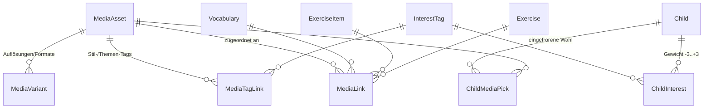

# Bilder & Medien: ein Motiv, viele Bilder, eines pro Kind

Übungsinhalte (Vokabeln, Sätze, Texte) sollen **bebildert** werden. Das Besondere: zu *einem* Motiv
gibt es **mehrere Bilder**, und zwar auf zwei völlig verschiedenen Achsen:

1. **Technisch** – dasselbe Bild in mehreren Auflösungen/Formaten/Seitenverhältnissen
   (Thumbnail in der Liste, Karte in der Übung, groß in der Vorschau).
2. **Inhaltlich** – dasselbe *Bedeutungs*motiv in mehreren Darstellungen für verschiedene
   Zielgruppen. Das Verb „laufen" als **laufendes Einhorn im Comic-Stil**, als **Flash**, als
   **joggende Person im Foto-Stil**. Welches ein Kind sieht, entscheidet sein Profil.

Achse 2 ist der eigentliche Punkt: Bebilderung ist hier **Individualisierung des Lerninhalts**, kein
Deko-Feature. Ein Bild, das den Lerner anspricht, bindet die Vokabel besser – ein beliebiges nicht.

> **Status:** **Etappen 1–6 sind umgesetzt** – die Kette steht durchgängig: Datei hochladen → Server
> skaliert → Zuordnen → Auswahl je Kind → Bild auf der Übungskarte des Sohns samt „anderes Bild".
> Offen ist nur noch **7** (Stufe „Bild → Wort", KI-generierte Assets). Details am Ende der Etappen-Tabelle.

---

## 1. Warum die heutigen Interessen dafür nicht reichen

Das Kind trägt bereits ein übungsunabhängiges Profil
([AdminEntities.cs](../backend/Pugling.Api/Models/AdminEntities.cs)):

```csharp
public Gender Gender { get; set; } = Gender.None;
public List<string> Interests { get; set; } = [];   // Freitext, JSON-Spalte
public string? ProfileNotes { get; set; }           // Freitext
```

Verbraucher ist heute **allein der KI-Creator**, der daraus Prompt-Text baut
([ChildBriefing.ToPromptText](../backend/Pugling.Agent.Creator/Briefing/ChildBriefing.cs),
[DraftPrompts](../backend/Pugling.Agent.Creator/Drafting/DraftPrompts.cs)) – ein LLM verträgt
Freitext, es liest „Brawl Stars" und kleidet den Stoff passend ein. Im **Frontend ist das Profil
nicht pflegbar** (kein Treffer für `interests` unter `frontend/src`), nur über API/Agent.

Für eine **deterministische Auswahl** – „welches von 8 Bildern zu *run* zeige ich diesem Kind?" –
ist Freitext untauglich:

| # | Lücke | Folge für die Bildauswahl |
| --- | --- | --- |
| 1 | **Nicht matchbar.** `"Brawl Stars"` trifft kein Bild-Tag `brawl-stars`/`videospiele`. | Ohne **gemeinsames, kontrolliertes Vokabular** auf beiden Seiten ist jedes Matching Zufall. |
| 2 | **Keine Gewichtung.** Lieblingsthema und „mag er auch" sind gleichrangig. | Kein Ranking, wenn mehrere Bilder passen. |
| 3 | **Keine Abneigungen.** Kein Feld für „keine Spinnen", „keine Clowns". | Wichtiger als Interessen – ein abstoßendes Bild kehrt den Effekt um. |
| 4 | **Keine Stil-Achse.** „Comic vs. Foto vs. Pixel-Art" ist orthogonal zum Thema. | Kind mag Pokémon, will aber Fotos – heute nicht ausdrückbar. |
| 5 | **Keine Eignungsgrenze.** Nichts sagt, *was ein Kind sehen darf*. | Trägt die Zielgruppen-Achse überhaupt erst (siehe § 4). |
| 6 | **Kein Feedback/Verfall.** Interessen eines 11-Jährigen kippen; „Bild abgelehnt" wird nirgends erfasst. | Das System lernt nie dazu. |
| 7 | **Kein Vater-UI.** | Die Basis der Individualisierung ist für den Supervisor unsichtbar. |

**Fazit:** Für den LLM-Einsatz reicht das Profil. Für Bildauswahl braucht es eine **kontrollierte
Interessens-Taxonomie**, die sich **dieselbe Tag-Tabelle mit den Bildern teilt** – das ist der
Dreh- und Angelpunkt des ganzen Entwurfs.

---

## 2. Datenmodell

Ein **Medien-Store** analog zum Vokabel-Store: kindneutral, zentral gepflegt, referenziert.
Vier neue Entitäten plus die geteilte Tag-Tabelle aus § 3.



### `MediaAsset` – *eine Darstellung*

Nicht „das Bild zu run", sondern „das laufende Einhorn im Comic-Stil". Trägt Bedeutung + Stil +
Eignung, **nicht** die Bytes.

```csharp
public class MediaAsset
{
    public int Id { get; set; }
    /// <summary>Stabiler Referenz-Key (z. B. "run_unicorn_comic") – wie Vocabulary.Key.</summary>
    public string Key { get; set; } = "";
    /// <summary>Was zu sehen ist – zugleich Alt-Text (Barrierefreiheit) und LLM-Suchtext.</summary>
    public string Description { get; set; } = "";
    public MediaKind Kind { get; set; }            // Image (heute), später Audio/Video
    /// <summary>Eignung; der Selektor filtert hart gegen Child.AllowedContentRating.</summary>
    public ContentRating Rating { get; set; } = ContentRating.Everyone;
    public string? License { get; set; }
    public string? Attribution { get; set; }
    /// <summary>Herkunft: Upload, Stock, KI-generiert (mit Modell/Prompt in Source).</summary>
    public MediaOrigin Origin { get; set; }
    public string? Source { get; set; }
    /// <summary>Dominante Farbe / winziger Blur-Hash für ruckelfreies Nachladen.</summary>
    public string? Placeholder { get; set; }
    public List<MediaVariant> Variants { get; set; } = [];
    public List<MediaTagLink> TagLinks { get; set; } = [];
}
```

### `MediaVariant` – *eine technische Ausprägung*

Dieselbe Darstellung, andere Bytes. Der Client fragt nach **Zweck**, nicht nach Pixeln – so bleibt
die Auflösungspolitik serverseitig änderbar.

```csharp
public class MediaVariant
{
    public int Id { get; set; }
    public int MediaAssetId { get; set; }
    /// <summary>Semantischer Slot: Thumb | Card | Full | Hero. Entkoppelt Client von Pixelmaßen.</summary>
    public MediaPurpose Purpose { get; set; }
    public int Width { get; set; }
    public int Height { get; set; }
    /// <summary>webp | avif | png | jpg – für <picture>/srcset-Auslieferung.</summary>
    public string Format { get; set; } = "webp";
    /// <summary>URL zur Datei (kein Base64 im Payload – wie PronunciationAudioUrl).</summary>
    public string Url { get; set; } = "";
    public long? Bytes { get; set; }
}
```

### `MediaLink` – *wo das Bild hängt*

n:m gegen mehrere Trägerarten. **Kein** eigenes „Motiv"-Entity: die Gruppe „alle Bilder, die *run*
meinen" ist genau die Menge der Links auf dieselbe `Vocabulary` – das Motiv ist der Träger.

```csharp
public class MediaLink
{
    public int Id { get; set; }
    public int MediaAssetId { get; set; }
    /// <summary>Genau eine der drei ist gesetzt (Check-Constraint).</summary>
    public int? VocabularyId { get; set; }      // Vokabel-Store: gilt für alle Übungen
    public int? ExerciseItemId { get; set; }    // nur diese Übung (übersteuert die Vokabel)
    public int? ExerciseId { get; set; }        // Titelbild für Text/Satz/Leseübung
    /// <summary>Redaktioneller Rang bei Gleichstand im Score (höher gewinnt).</summary>
    public int Weight { get; set; }
}
```

Die Kaskade **Item schlägt Vokabel** erlaubt es dem Creator, in einer bestimmten Übung bewusst ein
anderes Bild zu setzen, ohne den Store zu verbiegen.

### `ChildMediaPick` – *die eingefrorene Wahl*

Der wichtigste nicht-offensichtliche Teil. Beim **Vokabellernen ist Bildkonstanz gewollt**: das Kind
soll bei jeder Wiederholung derselben Karte dasselbe Bild sehen – Wiedererkennung ist genau der
Merkeffekt. Rotierende Bilder zerstören ihn.

Also: die Auswahl läuft **einmal** und wird festgehalten – dasselbe Muster wie der eingefrorene
Ausspiel-Cursor der Übungssitzung.

```csharp
public class ChildMediaPick
{
    public int Id { get; set; }
    public int ChildId { get; set; }
    /// <summary>Der Träger, für den gewählt wurde (Vokabel oder Item) – wie in MediaLink.</summary>
    public int? VocabularyId { get; set; }
    public int? ExerciseItemId { get; set; }
    public int MediaAssetId { get; set; }
    public DateTime PickedAt { get; set; } = DateTime.UtcNow;
    /// <summary>Vom Kind/Vater abgelehnt → beim nächsten Zug ausgeschlossen (billigstes Feedback).</summary>
    public bool Rejected { get; set; }
}
```

`POST …/media-picks/{…}/reshuffle` („anderes Bild") verwirft die Wahl und zieht neu, der Ausschluss
bleibt. Das ist zugleich die Datenquelle, mit der sich das Interessenprofil später nachschärfen lässt.

---

## 3. Die geteilte Taxonomie (der Angelpunkt)

**Eine** Tag-Tabelle für *beides* – Kind-Interessen **und** Bild-Eigenschaften. Nur so ist Matching
mehr als Stringvergleich. Bauart analog `VocabTag`/`VocabTagLink`, aber facettiert.

```csharp
public class InterestTag
{
    public int Id { get; set; }
    public string Slug { get; set; } = "";      // "pokemon", "fussball", "comic"
    public string Label { get; set; } = "";     // "Pokémon"
    /// <summary>Facette: Franchise | Sport | Tier | Fahrzeug | Musik | Stil | Ton | …</summary>
    public InterestFacet Facet { get; set; }
    /// <summary>Synonyme für den Freitext-Backfill und die Creator-Suche ("Poke", "Pikachu").</summary>
    public List<string> Synonyms { get; set; } = [];
}

public class ChildInterest
{
    public int ChildId { get; set; }
    public int InterestTagId { get; set; }
    /// <summary>-3 (starke Abneigung) … 0 (neutral) … +3 (Lieblingsthema).</summary>
    public int Weight { get; set; }
}
```

Die Facette `Stil` (Comic, Foto, Pixel-Art, Aquarell …) sitzt bewusst in **derselben** Tabelle: sie
verhält sich beim Scoring identisch zum Thema, ist nur eine andere Achse. Kein Parallel-Feld.

**Am Kind zusätzlich:**

```csharp
/// <summary>Obergrenze der Eignung; nur der Supervisor darf sie heben. Default: Everyone.</summary>
public ContentRating AllowedContentRating { get; set; } = ContentRating.Everyone;
```

**Freitext bleibt.** `Interests`/`ProfileNotes` verschwinden nicht – der KI-Creator lebt davon und
Freitext fängt alles, was (noch) kein Tag ist. Beim Backfill wird jeder bestehende Freitext-Eintrag
per Slug/Synonym auf einen `InterestTag` abgebildet und sonst als neuer Tag angelegt: verlustfrei.

---

## 4. Auswahl: `MediaSelector`

Eine Stelle, ein Service – analog zum `ScoringService` als *der* Ort für Punkte.

```text
Eingang: (Träger, Kind, MediaPurpose)
Ausgang: MediaVariant + Alt-Text  |  null (kein Bild)
```

1. **Kandidaten** – alle `MediaLink`s des Trägers (Item schlägt Vokabel), Asset geladen.
2. **Hartes Filtern**
   - `asset.Rating > child.AllowedContentRating` → **raus**.
   - Asset trägt einen Tag mit `ChildInterest.Weight < 0` → **raus** (Abneigung sticht immer).
   - Bereits `Rejected` → raus.
   - Keine Variante für den gefragten `Purpose` → raus.
3. **Scoring** – Σ über die Tag-Schnittmenge: `Weight` des Kind-Interesses, Themen- und Stil-Facette
   getrennt gewichtet (Thema ×2, Stil ×1). `MediaLink.Weight` wird **nicht** aufaddiert, sondern bricht
   Gleichstände – sonst könnte ein hoher redaktioneller Rang das Profil des Kindes überstimmen.
4. **Deterministischer Tiebreak** über `Hash(childId, trägerId)` – kein `Random`, damit ein
   Wiederaufbau der Wahl (z. B. nach einem Reset) dasselbe Ergebnis liefert.
5. **Einfrieren** in `ChildMediaPick`.

Kein Treffer → **kein Bild**, nie ein Notnagel-Bild. Eine unbebilderte Karte ist besser als eine
irreführend bebilderte.

Die Regel aus § 1.5 fällt hier zusammen: der `Rating`-Filter ist der Grund, warum ein *gemeinsamer*
Store für alle Zielgruppen überhaupt tragfähig ist. Ohne ihn wäre die Interessens-Auswahl nicht
kontrollierbar; mit ihm ist die Zielgruppen-Achse offen (auch für erwachsene Lerner) und für ein
Kindprofil per Default dicht, hebbar nur durch den Supervisor.

---

## 5. Auslieferung an die Übung

Der Weg ist bereits gebahnt – das Audio geht ihn schon:

| Ebene | Heute | Ergänzung |
| --- | --- | --- |
| [`ContentItem`](../backend/Pugling.Api/Services/Shared/ExerciseContentProvider.cs) | `AudioUrl` | `ImageUrl`, `ImageAlt` |
| [`IExerciseType.StageFacets`](../backend/Pugling.Api/Exercises/IExerciseType.cs) | `(LetterBoxLength, AudioUrl)` | `+ ImageUrl` – **stufenabhängig** |
| [`PracticeCard`](../backend/Pugling.Contracts/Student/PracticeDtos.cs) | `AudioUrl` | `ImageUrl`, `ImageAlt` |
| [`ExerciseContentResolver`](../backend/Pugling.Api/Services/Shared/ExerciseContentResolver.cs) | lädt Store-Vokabeln | ruft zusätzlich den `MediaSelector` |

**Anti-Cheat, stufenabhängig.** Beim Audio gilt schon: die Hörstufe darf die Audioquelle nicht
mitgeben, wenn das vorgelesene Wort die Lösung ist (siehe `AntiCheatTests`). Beim Bild ist es
schärfer – ein Bild von „laufen" verrät die Lösung in **beiden** Richtungen. Deshalb gehört die
Entscheidung in `StageFacets`, nicht in den Resolver:

- *`ShowBoth` und `SelfAssess`* – Bild **und** Alt-Text. Die Lösung ist dort ohnehin aufgedeckt, und
  genau hier erfüllt das Bild seinen Zweck: das Einprägen.
- *`LetterBoxes`, `FreeText`, `Audio`, `MultipleChoice`* – **kein** Bild. Umgesetzt als
  `IsTypedStage(stage) ? null : item.ImageUrl` im `VocabularyExerciseType`.
- Der **Alt-Text folgt dem Bild**: fällt das Bild weg, fällt er mit. Sonst leakte die Beschreibung
  („Ein Einhorn läuft") auf einer getippten Stufe genau das, was das Bild verraten hätte – ein Loch,
  das man leicht übersieht, weil man nur an die URL denkt.

> **Bewusst nicht verfeinert:** streng genommen wäre das Bild auch auf getippten Stufen unschädlich,
> wenn die Abfragerichtung *rückwärts* läuft (Prompt „laufen", Antwort „run") – das Motiv zeigt dann die
> Prompt-Seite und buchstabiert die Lösung nicht. Diese Feinunterscheidung hängt aber an `Direction`
> **und** an `both` (das je Item wechselt) und wäre schwer erklärbar, wenn sie einmal danebengreift.
> Die Regel bleibt deshalb bei „nicht getippt = Bild".
>
> Die *saubere* Art, Bilder ins aktive Abfragen zu holen, ist die **eigene Stufe „Bild → Wort"** (das
> Bild ist der Prompt) – didaktisch stark, aber eine eigene Etappe, weil sie den Stufen-Fahrplan berührt.

**Dateien.** Assets liegen nicht in der DB. Erste Stufe: nur URLs (Creator pflegt Fremd-URLs oder
Dateien, die er selbst nach `wwwroot/media/` legt – die App liefert `wwwroot` bereits aus, siehe
`Program.cs`). Upload + serverseitiges Resize sind eine spätere Etappe (braucht ImageSharp und eine
Speicher-Abstraktion, damit später Blob-Storage möglich ist).

---

## 6. Endpunkte (Skizze)

| Ebene | Route | Zweck |
| --- | --- | --- |
| Creator | `api/v1/creator/media` | CRUD Assets (Filter: `?tag=`, `?rating=`, `?kind=`, `?q=`) |
| Creator | `api/v1/creator/media/{id}/variants` | CRUD Auflösungen |
| Creator | `api/v1/creator/media/{id}/tags` | Tags am Asset |
| Creator | `api/v1/creator/vocabulary/{id}/media` | Zuordnung zum Motiv (+ `weight`) |
| Creator | `api/v1/creator/…/vocabulary/{exId}/items/{itemId}/media` | übungslokale Übersteuerung |
| Creator | `api/v1/creator/interest-tags` | Taxonomie pflegen (global) |
| Supervisor | `api/v1/supervisor/children/{id}/interests` | gewichtete Interessen + Abneigungen |
| Supervisor | `api/v1/supervisor/children/{id}` (PATCH) | `allowedContentRating` |
| Student | `api/v1/student/children/{id}/media-picks/{…}/reshuffle` | „anderes Bild" |

Neue Fehler-Codes additiv in [`ApiErrors`](../backend/Pugling.Api/Errors/ApiErrors.cs):
`media_not_found`, `media_rating_not_allowed`, `media_variant_missing`.

---

## 7. Etappen

| # | Etappe | Inhalt | Status |
| --- | --- | --- | --- |
| 1 | **Medien-Store** | `MediaAsset` + `MediaVariant`, Creator-CRUD, URL-basiert (kein Upload). Migration. | ✅ |
| 2 | **Taxonomie** | `InterestTag` + `ChildInterest` + `AllowedContentRating`, Backfill der Freitext-Interessen, Supervisor-CRUD; `ChildBriefing` zieht nach. | ✅ |
| 3 | **Zuordnung** | `MediaLink` + CRUD an Vokabel/Item/Übung. | ✅ |
| 4 | **Auswahl** | `MediaSelector` + `ChildMediaPick` + Reshuffle; `ContentItem`/`PracticeCard`/`StageFacets`; Anti-Cheat-Regel + Tests. | ✅ |
| 5 | **Upload** | Multipart + serverseitige Varianten-Erzeugung, Speicher-Abstraktion. | ✅ |
| 6 | **Frontend** | Interessen-Editor (Vater), Bild-Bibliothek + Zuordnung an der Vokabel, Bild auf der Sohn-Karte, „anderes Bild"-Button. | ✅ |
| 7 | **Optional** | Stufe „Bild → Wort"; KI-generierte Assets über den Creator-Agenten (`Origin = Generated`, Prompt in `Source`). | offen |

Etappe 1–4 ist der tragfähige Kern; **2 ist die Voraussetzung dafür, dass 4 überhaupt sinnvoll ist**.

### Was Etappe 5 gebracht hat (Upload)

`POST creator/media/upload` (multipart) nimmt **eine** Datei und erzeugt daraus alles Weitere:
[MediaImageProcessor](../backend/Pugling.Api/Services/Shared/MediaImageProcessor.cs) skaliert auf
Thumb/Card/Full und ermittelt die Platzhalterfarbe,
[IMediaStorage](../backend/Pugling.Api/Services/Shared/MediaStorage.cs) legt sie ab. Der URL-Weg bleibt
daneben – Stock-Bilder liegen oft schon irgendwo.

**Fünf Festlegungen, die man später nicht mehr billig ändert:**

1. **SkiaSharp statt ImageSharp.** ImageSharp 4 **bricht den Build ohne Lizenzschlüssel ab** (Split
   License, kommerziell lizenzpflichtig). SkiaSharp ist MIT/BSD; die NativeAssets braucht nur ein
   Linux-Deploy. Das war keine Geschmacksfrage, sondern eine Lizenzpflicht, die wir nicht eingehen.
2. **Eigener Ordner, nicht `wwwroot`.** Dorthin kopiert der Deploy das gebaute Frontend – ein Redeploy
   hätte die Bilder der Familie mitgelöscht. Konfigurierbar über `Media:RootPath`, ausgeliefert unter
   `Media:PublicPath` (Default `/media`) per eigener Static-Files-Middleware.
3. **Ordnername = Asset-Id, nicht Key.** Der Key kommt aus einer Nutzereingabe; ein `../` darin wäre ein
   Schreibzugriff außerhalb der Wurzel. Die Id ist immer dateisystem-sicher. (Der Pfad-Guard in
   `LocalMediaStorage.Resolve` bleibt trotzdem – doppelter Boden.)
4. **Nie hochskalieren, nie beschneiden.** Eine kleine Quelle wird nicht aufgeblasen (nur unschärfer und
   größer), und skaliert wird seitenverhältnis-erhaltend – ein Zuschnitt könnte dem laufenden Einhorn den
   Kopf abschneiden. Deshalb erzeugt der Upload **kein** `Hero`: das breite Format verlangt redaktionellen
   Beschnitt, und den kann nur ein Mensch verantworten.
5. **Dateien werden erst nach dem DB-Commit gelöscht.** Andersherum bliebe bei einem DB-Fehler ein Asset
   ohne Datei zurück – eine kaputte Karte. Eine verwaiste Datei ist dagegen harmlos.

### Was Etappe 6 gebracht hat (Frontend)

- **Kind-Profil** (`/vater/kind/:childId`, [VaterKind.tsx](../frontend/src/vater/VaterKind.tsx)):
  gewichtete Interessen mit getrennten Listen „Mag"/„Mag nicht" und die Bild-Freigabe als eigene,
  erklärte Auswahl. Vorschläge kommen aus Tags, die schon Bilder tragen – so führt eine Eingabe
  garantiert zu Treffern. Verlinkt aus der Kinder-Tabelle des Dashboards.
- **Bild-Bibliothek** (`/vater/media`, [VaterMedia.tsx](../frontend/src/vater/VaterMedia.tsx)):
  anlegen (per URL), Vorschau, Schlagworte ergänzen, „Wo benutzt?" und löschen. Assets ohne Datei oder
  ohne Schlagwort sind als solche markiert – beides macht sie für die Auswahl unsichtbar.
- **Zuordnung an der Vokabel** ([VocabMediaPanel.tsx](../frontend/src/vater/VocabMediaPanel.tsx)):
  aufklappbar in jeder Store-Zeile, neben dem Tag-Editor.
- **Sohn-Karte**: Bild über dem Wort (nicht darunter – es ist Lernhilfe, keine Deko) plus ein bewusst
  unaufdringlicher „🔄 anderes Bild"-Knopf.
- **E2E** ([bilder.spec.ts](../frontend/e2e/bilder.spec.ts)): die ganze Kette in einem Lauf, mit
  `data:`-URLs statt Fremdbildern (hermetisch, kein Netzzugriff).

### Was Etappe 1–4 konkret gebracht haben

- **Store & Auflösungen:** [MediaEntities.cs](../backend/Pugling.Api/Models/MediaEntities.cs),
  [MediaAssetsController](../backend/Pugling.Api/Controllers/Creator/MediaAssetsController.cs),
  [MediaVariantsController](../backend/Pugling.Api/Controllers/Creator/MediaVariantsController.cs).
- **Geteilte Taxonomie:** [InterestEntities.cs](../backend/Pugling.Api/Models/InterestEntities.cs),
  [InterestTagsController](../backend/Pugling.Api/Controllers/Creator/InterestTagsController.cs),
  [ChildInterestsController](../backend/Pugling.Api/Controllers/Supervisor/ChildInterestsController.cs).
  Das Findet-sonst-legt-an liegt an *einer* Stelle
  ([InterestTagService](../backend/Pugling.Api/Services/Shared/InterestTagService.cs)) – sonst zerfiele
  das Vokabular in Dubletten und das Matching liefe leer.
- **Backfill:** [InterestTagBackfill](../backend/Pugling.Api/Data/InterestTagBackfill.cs) überführt die
  Freitext-Interessen beim Start (Gewicht 2), idempotent. Der Freitext bleibt – der KI-Creator lebt davon.
- **Der Agent kennt jetzt Abneigungen:** `ChildBriefing` rendert die gewichteten Interessen und eine
  eigene Zeile „Vermeide unbedingt". Eine Aufgabe über Spinnen ist fachlich korrekt und trotzdem
  unbrauchbar, wenn das Kind Spinnen nicht erträgt.
- **Zuordnung (Etappe 3):** [MediaLink](../backend/Pugling.Api/Models/MediaEntities.cs) +
  [MediaLinkService](../backend/Pugling.Api/Services/Shared/MediaLinkService.cs) (drei Träger, ein
  Ablauf), [VocabularyMediaController](../backend/Pugling.Api/Controllers/Creator/VocabularyMediaController.cs)
  (Store-Regel, frei pflegbar) und [ExerciseMediaController](../backend/Pugling.Api/Controllers/Creator/ExerciseMediaController.cs)
  (Item-Übersteuerung + Titelbild, **Schreibrecht nötig**). Rückrichtung: `GET media/{id}/usage`.
- **Auswahl (Etappe 4):** [MediaSelector](../backend/Pugling.Api/Services/Shared/MediaSelector.cs) +
  `ChildMediaPick`; der Weg zur Karte läuft über `ExerciseContentResolver.ItemsOfAsync(exercise, childId)`
  → `ContentItem.ImageUrl/ImageAlt` → `IExerciseType.StageFacets` → `CardFacets` →
  `PracticeCard`/`TestItem`. „Anderes Bild":
  [ChildMediaPicksController](../backend/Pugling.Api/Controllers/Student/ChildMediaPicksController.cs).
- **Client-Fassaden:** `CreatorApi.*Media*/​*InterestTag*/​*MediaLink*`, `SupervisorApi.*Interests*`,
  `StudentApi.ReshuffleMediaAsync`.
- **Tests:** [MediaStoreTests](../backend/Pugling.Api.Tests/MediaStoreTests.cs),
  [InterestTaxonomyTests](../backend/Pugling.Api.Tests/InterestTaxonomyTests.cs),
  [MediaLinkTests](../backend/Pugling.Api.Tests/MediaLinkTests.cs),
  [MediaSelectionTests](../backend/Pugling.Api.Tests/MediaSelectionTests.cs) + drei Fälle in
  `PuglingClientTests`. Neue Fehler-Codes: `media_variant_not_found`, `media_variant_exists`,
  `media_already_linked`, `media_link_not_found`, `media_no_alternative`, `media_not_on_card`.

**Acht Entscheidungen, die beim Bauen konkret wurden:**

1. **`ContentRating` liegt als `int` in der DB**, alle anderen Enums als String. Der Selektor vergleicht
   *ordnend* (`Rating <= Erlaubtes`); als String liefe der Vergleich alphabetisch
   („Everyone" < „Mature" < „Teen") und wäre schlicht falsch. Dasselbe gilt für
   `Child.AllowedContentRating`.
2. **Der Slug ist unveränderlich.** Er ist die Referenz, an der Bilder *und* Kind-Profile hängen;
   umbenennbar sind nur Label, Facette, Synonyme und Farbe.
3. **„Genau ein Träger" steht als Check-Constraint in der DB**, nicht nur im Controller: eine Zeile ohne
   Träger wäre unsichtbar, eine mit zweien mehrdeutig auflösbar. Je Träger ein eigener *gefilterter*
   Unique-Index – ein gemeinsamer über alle drei Spalten griffe nicht, weil NULLs in SQLite als
   verschieden gelten. Verifiziert: der direkte SQL-Insert wird in beiden Richtungen abgewiesen.
4. **Rechte-Asymmetrie ist Absicht.** Die Store-Zuordnung (Vokabel) darf jeder Creator setzen – der
   Wortschatz ist kindneutral und gemeinsam. Die Übungs-Zuordnung (Item-Übersteuerung, Titelbild) ändert
   fremden Inhalt und verlangt `CanWriteAsync` → sonst `403 not_author`.
5. **Die Bebilderung hängt an einem expliziten `childId`-Parameter**, nicht an einer geladenen
   Navigation. `ItemsOfAsync(exercise, childId)` – ohne Kind kein Bild. Hinge es an
   `pos.StudyPlan?.ChildId`, entschiede ein vergessenes `Include`, ob ein Kind Bilder sieht; das wäre
   ein stiller Fehler, den kein Test zuverlässig fängt. Kind-neutrale Pfade (Vorschau, Auswertung,
   Ziel-Berechnung) sparen so zugleich die Auswahl-Queries.
6. **„Kein Alternative" verbrennt den letzten Kandidaten nicht.** Reshuffle prüft *vor* dem Ablehnen, ob
   es überhaupt eine Alternative gibt, und lässt den Bestand sonst unangetastet (`409
   media_no_alternative`). Andernfalls könnte ein Kind sich durch wiederholtes Klicken dauerhaft
   bildlos machen.
7. **„Anderes Bild" trägt die Schranken der Ausspielung.** Der Karten-Endpunkt *gibt ein Bild heraus* und
   ist damit derselben Anti-Cheat-Regel unterworfen wie die Karte: spielbarer Plan, nur Indizes der
   eingefrorenen Sitzungs-Reihenfolge, und nur wo die Karte auch ein Bild zeigt (`409
   media_not_on_card`). Auf einer getippten Stufe lieferte er sonst Bild **und** Alt-Text – also genau die
   Bedeutung des Wortes, das getippt werden soll. Der eine Code deckt „getippte Stufe" und „kein Bild"
   bewusst gemeinsam ab, damit der Fehler nicht verrät, ob es überhaupt ein Bild *gäbe*.
8. **Eine unzulässig gewordene Einfrierung wird zurückgezogen, nicht übergangen.** Sinkt die Freigabe,
   kommt eine Abneigung dazu oder verschwindet die Zuordnung, ist das eingefrorene Bild nicht mehr
   ausspielbar – dann muss die Zeile *weg*. Bliebe sie als aktive Wahl liegen, fiele die Neuwahl bei jedem
   Abruf erneut und das zweite Einfrieren risse den gefilterten Unique-Index: die Karte wäre für dieses
   Kind dauerhaft nicht mehr abrufbar, ohne Weg zurück über die API. **Gelöscht, nicht abgelehnt** –
   „abgelehnt" heißt „nie wieder", der Grund hier ist aber vorübergehend.

**Zwei Fallstricke, die beim Weiterbauen leicht wieder aufgehen:**

- **Der Konflikt beim Einfrieren wird bewusst verschluckt** (`MediaSelector.SaveFreezeAsync`). Zwei
  gleichzeitige Karten-Abrufe desselben Kindes (React-StrictMode-Doppelaufruf, Doppeltipp, zweiter Tab)
  schreiben denselben `ChildMediaPick`; der Verlierer läuft in den gefilterten Unique-Index. Das ist
  harmlos, und zwar nicht zufällig: **die Auswahl ist deterministisch**, der Gewinner hat also genau
  dieselbe Zeile geschrieben – der Konflikt heißt hier immer „schon erledigt". Das Einfrieren ist ein
  Cache-Auffüllen aus einem GET; ein durchgereichter Fehler wäre nur ein 500. Wer den `catch` entfernt,
  holt sich den Fehler zurück.
- **`MediaPurpose` liegt als String in der DB.** Ein `OrderBy(v => v.Purpose)`, das in SQL übersetzt wird,
  sortiert daher alphabetisch (Card, Full, Hero, Thumb) statt semantisch (Thumb → Card → Full → Hero).
  Varianten deshalb **im Speicher** sortieren – sonst widersprechen sich `media/{id}` und
  `media/{id}/variants` bei identischen Daten.

## Regeln in Kurzform (aus der Root-CLAUDE.md hierher verlagert)

Diese Zusammenfassung lag bis 2026-07-28 in der [CLAUDE.md im Repo-Root](../CLAUDE.md) und damit in
*jeder* Sitzung im Kontext. Sie beschreibt **ein** Subsystem – das Detail gehört hierher. **Nicht**
verlagert wurden die Anti-Cheat-Schranken: die bleiben in der Root-CLAUDE.md, weil sie beim Bauen einer
Ausspielung greifen müssen, auch wenn niemand dieses Dokument geöffnet hat.

**Modell.** Zwei Achsen bleiben getrennt: `MediaAsset` ist *eine Darstellung* („laufendes Einhorn im
Comic-Stil") mit Stil-Tags und `ContentRating`, `MediaVariant` dieselbe Darstellung in einer Auflösung –
adressiert über den semantischen `MediaPurpose` (Thumb/Card/Full/Hero), nicht über Pixelmaße. Bytes liegen
nie in der DB, nur URLs. Route: `api/v1/creator/media` (+ `…/{id}/variants`, `…/{id}/tags`).

**Der Angelpunkt ist die geteilte Taxonomie:** `InterestTag` (Slug + Facette, u. a. `Style`) wird von
Bildern *und* Kindern referenziert (`ChildInterest` mit Gewicht **-3…+3**, negativ = Abneigung, unter
`api/v1/supervisor/children/{}/interests`). Nur weil beide Seiten aus **einem** Vokabular schöpfen, ist die
Bildauswahl berechenbar – deshalb läuft jedes Findet-sonst-legt-an über `InterestTagService`.
`Child.Interests` (Freitext) bleibt daneben: es ist die Sprache des KI-Creators. `ContentRating` +
`Child.AllowedContentRating` liegen **als int** in der DB (ordnender Vergleich – als String wäre er
alphabetisch und damit falsch).

**Zuordnung** über `MediaLink` – **n:m in beide Richtungen** (ein Wort trägt viele Darstellungen, ein Bild
dient vielen Wörtern), deshalb eigene Tabelle statt Spalte am Träger wie beim 1:1-Aussprache-Audio. Genau
*ein* Träger je Zeile (DB-Check-Constraint): `Vocabulary` = Regel für alle Übungen
(`api/v1/creator/vocabulary/{}/media`, jeder Creator), `ExerciseItem` = übungslokale Übersteuerung und
`Exercise` = Titelbild (beide unter `api/v1/creator/exercises/{}/…`, **Schreibrecht** nötig).
Genauigkeits-Kaskade: Item schlägt Vokabel. Rückrichtung `media/{id}/usage`; Löschen ist bewusst *nicht*
gesperrt (kein Platzhalter wie bei Vokabeln – die Auswahl schrumpft nur).

**Auswahl je Kind** (`MediaSelector`): hart filtern (Eignung über Freigabe, Abneigung = negativ gewichteter
Tag, bereits abgelehnt, keine Variante) → nach Interessen bewerten (Thema ×2, Stil ×1; `MediaLink.Weight`
bricht nur Gleichstände, gefolgt von einem stabilen FNV-Hash – **kein** `Random` und **kein**
`string.GetHashCode`, der ist pro Prozess randomisiert) → **einfrieren** in `ChildMediaPick`. Das Einfrieren
ist der Kern: beim Vokabellernen ist Bildkonstanz der Merkeffekt, ein nachträglich hinzugefügtes Bild darf
die laufende Wahl nicht kippen. „Anderes Bild" über
`api/v1/student/children/{}/media-picks/reshuffle` (lehnt dauerhaft ab; ohne Alternative
`409 media_no_alternative`, statt den letzten Kandidaten zu verbrennen).

**Weg zur Karte:** `ItemsOfAsync(exercise, childId)` → `ContentItem.ImageUrl/ImageAlt` → `StageFacets` →
`CardFacets` → `PracticeCard`/`TestItem`.

**Upload** (Etappe 5): `POST creator/media/upload` (multipart) → `MediaImageProcessor` skaliert auf
Thumb/Card/Full (WebP, **nie hochskalieren, nie beschneiden** – daher kein `Hero`) und ermittelt eine
Platzhalterfarbe; `IMediaStorage` legt ab. Der Ordner ist **nicht** `wwwroot` (das überschreibt der
Frontend-Deploy), sondern `Media:RootPath` (Default `media-uploads`), ausgeliefert unter `Media:PublicPath`
(`/media`); Ordnername ist die Asset-**Id**, nie der nutzergesetzte Key. Bildbibliothek ist **SkiaSharp**
(MIT/BSD) – ImageSharp 4 bricht den Build ohne Lizenzschlüssel ab.

**Frontend** (Etappe 6): `/vater/kind/:id` (gewichtete Interessen + Bild-Freigabe), `/vater/media`
(Bibliothek), Bilder-Panel je Vokabelzeile, Bild + „anderes Bild" auf der Sohn-Karte; E2E
[frontend/e2e/bilder.spec.ts](../frontend/e2e/bilder.spec.ts).

**Offen:** Stufe „Bild → Wort" (7).

---

**Verwandt:** [endpunkt-beziehungen.md](endpunkt-beziehungen.md) ·
[vokabel-funktionalitaeten-entwickler-tutorial.md](vokabel-funktionalitaeten-entwickler-tutorial.md) ·
[wiki/03 · Übungstypen](../wiki/03-uebungstypen.md) · [wiki/08 · Erweitern](../wiki/08-erweitern.md) ·
[wiki/09 · LLM-Kochbuch](../wiki/09-llm-kochbuch.md)
