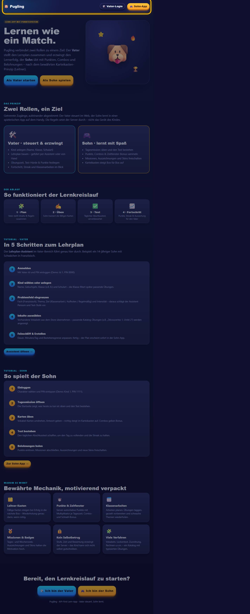
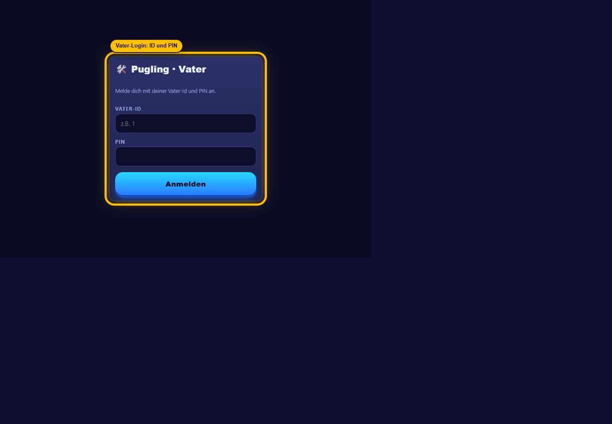
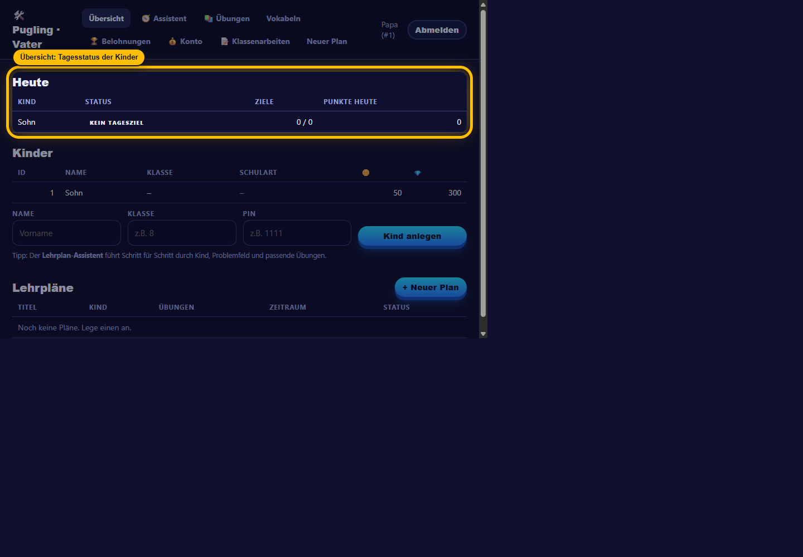
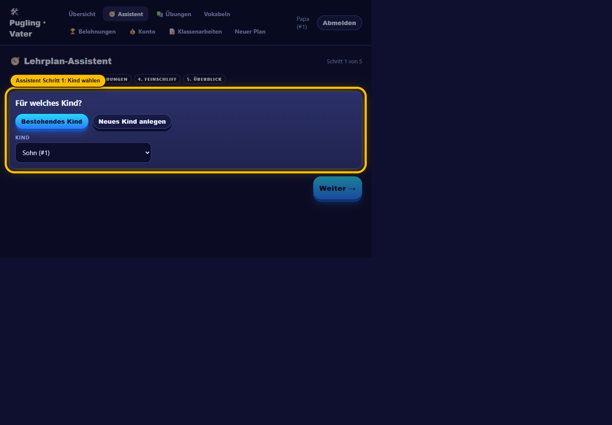
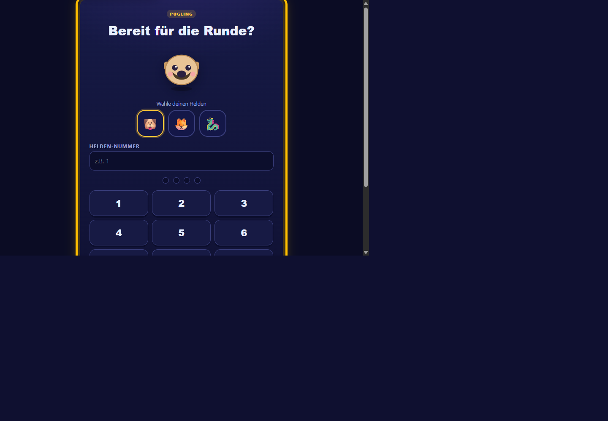
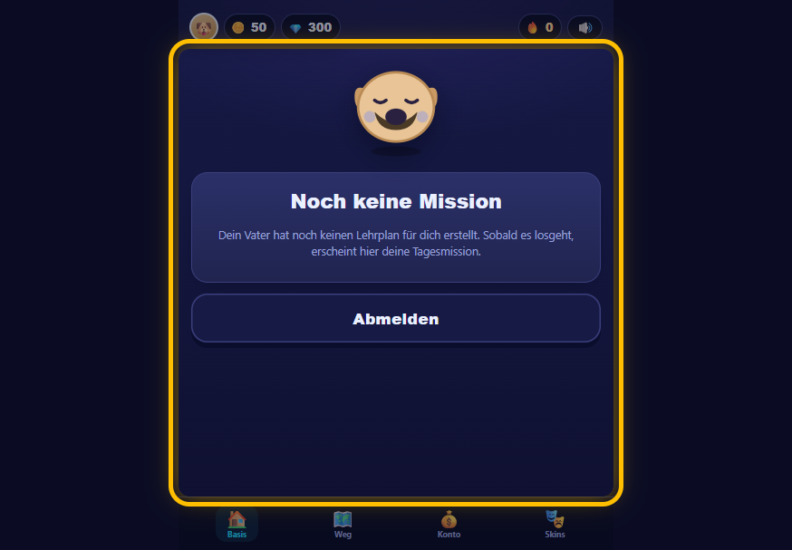

# PM-Sitzung: Produktvorstellung & Feedback-Iteration

**Datum:** 2026-07-04
**Moderation:** PM
**Teilnehmer:** Vater (steuert Lernerfolg), Sohn (~11, 5. Klasse, Französisch), Entwickler
**Ziel:** Ersten funktionalen Stand vorstellen, Feedback beider Rollen aufnehmen, an den
Entwickler geben und iterieren, **bis beide zufrieden sind**.

> Historisches Protokoll vor dem Lehrplan-Umbau vom 2026-07-05. Genannte `items`-/`today`-/`report`-
> Routen sind teilweise durch positionsbasierte Endpunkte ersetzt; aktuelle Referenz:
> [wiki/04-lernplan-bauen.md](../wiki/04-lernplan-bauen.md) und [wiki/07-api-referenz.md](../wiki/07-api-referenz.md).

Grundlage der Vorstellung ist die **echte App** (React-Frontend `frontend/` gegen die
`api/v1`-Backend-API). Hinweis fürs Protokoll: Die Claude-Skills `vater`/`sohn` sind ein
*paralleles*, dateibasiertes Kurs-Format und **nicht** Teil des vorgestellten Produkts — das
wurde als bekannte konzeptionelle Doppelspur notiert (siehe Backlog B-9).

---

## Runde 1 — Vorstellung & Feedback

### PM-Vorstellung (Kurzfassung, was demonstriert wurde)
- **Vater-Web** (`/vater`): Login, Kinder anlegen (Name/Klasse/PIN) + Punktestand, Vokabel-Store,
  Lehrplan-Assistent (Kind → „Wo hakt es?" → Vokabeln → Feinschliff → erstellen), Plan-Detail mit
  Punkte/Tage/Streak, Tagesverlauf und Leitner-Boxen.
- **Sohn-Arcade-PWA** (`/sohn`): Helden-Login, HUD (Avatar/Münzen/Streak), Tagesmission mit
  Maskottchen-Stimmungen, Üben (Karteikarte + Combo + Feier-Animationen + Münz-Toast), Tagestest
  (Prozent-Ring, ✅/❌-Liste), Trophäenweg (Ligen/Boxen/Kalender/Badges), Skins.
- **Server-autoritatives Scoring** (Anti-Cheat), Missionen/Auszeichnungen im Backend.

#### Screenshots der gezeigten App-Flächen

### Feedback Vater (O-Ton, gekürzt)
**Gefällt:** Lehrplan-Assistent („ich will steuern, nicht basteln"); server-vergebene Punkte
(fälschungssicher = Grundvoraussetzung); Plan-Detail als Beleg der Wirkung; die Arcade zieht das Kind rein.

**Stört / fehlt:**
- **Klassenarbeiten** nicht anlegbar — „der eigentliche Ernstfall entscheidet die Note".
- Kein **Lern-Report**, welche Vokabel sitzt/nicht sitzt (wird berechnet, aber nicht gezeigt).
- **Belohnungen/Missionen** nicht selbst festlegbar — „mein Motivationshebel, beim Sohn aktuell leer".
- Plan nach Anlage **nicht änderbar/verlängerbar/abschaltbar**; Kind-Stammdaten nicht korrigierbar.
- Keine **Tages-/Mehr-Kind-Übersicht** („wer hat gestern was verpasst?").

**Top-3 (K.-o.-Kriterien):**
1. Klassenarbeiten anlegen, vorbereiten, nachüben.
2. Belohnungen/Missionen selbst festlegen.
3. Pläne nachträglich ändern/verlängern.

### Feedback Sohn (O-Ton, gekürzt)
**Mega:** Helden-Login; **Combo** (⚡, fliegender Ninja ab ×10); knuffiges Maskottchen +
Münzen sammeln; „SIEG!"-Prozent-Ring.

**Nervt / verarscht:**
- **Skin-Kauf ist Fake**: Münzen gehen nicht runter, auf anderem Gerät ist der Skin weg. „Dann spar ich nie wieder."
- Manches Üben zählt **0 Münzen/keine Combo** ohne Erklärung (fühlt sich kaputt an).
- **Kein Sound / kein Vibrieren**; **keine Feier** bei Mission/Badge.
- Teure Skins nur ein großes Emoji, nicht gezeichnet.
- Üben immer gleich → langweilig; kein Tempo-Modus, kein Level-Pfad, keine Buchstaben-Kästchen.

**Top-3 Wünsche:**
1. **Skins richtig kaufen** (Münzen weg, Skin bleibt, geräteübergreifend).
2. **Sound + Haptik + „TADAA"-Moment** bei Combo/Sieg/Badge.
3. **Abwechslung** (Tempo-Modus, Buchstaben-Kästchen mit Tipp-Knopf).

---

## PM-Synthese & Priorisierung (→ Entwickler)

**Beobachtung:** Fast alles, was der Vater vermisst, existiert bereits im Backend, aber ohne
Vater-UI. Fast alles, was den Sohn nervt, ist Frontend-Politur — **außer** dem Skin-Kauf, der ein
echter Produkt-/Korrektheitsfehler ist (der zentrale „Verdienen→Ausgeben"-Kreislauf ist unecht).

**Roter Faden für die Iterationen:** den **Belohnungs-Kreislauf echt machen** —
Vater setzt Belohnung → Sohn verdient Münzen → Sohn gibt Münzen wirklich aus.

| Prio | Item | Größe | Zuordnung |
|------|------|-------|-----------|
| **P0** | Skin-Kauf server-autoritativ (Münzen abbuchen, Besitz/Skin am Kind persistieren) | S–M, API-First | **Iteration 1** |
| **P1** | Missionen/Belohnungen als Vater anlegen (Backend-CRUD existiert → UI + Client) | M, Frontend | **Iteration 2** |
| P2 | Pläne ändern/verlängern/deaktivieren (PATCH/Items existieren → UI + Client) | M, Frontend | Roadmap |
| P2 | Klassenarbeiten-UI (Controller existiert → UI + Client) | L, Frontend | Roadmap |
| P3 | Lern-Report-Ansicht (`/report` existiert → UI) | S–M, Frontend | Roadmap |
| P3 | Sound/Haptik + Mission/Badge-Feier | S, Frontend | Roadmap |
| P3 | Übungs-Abwechslung (Tempo-Modus, LetterBoxes, Tipp-Knopf) | L, Frontend | Roadmap |

**Entwickler-Brief Iteration 1 (P0):** Skin-Kauf serverseitig echt machen.
- Server ist Quelle der Wahrheit für Kosten & Besitz (kein Client-Betrug).
- Kauf = negative Punkte-Buchung (neuer `PointKind`) + Besitz/ausgerüsteter Skin am `Child`.
- Guards: existiert, nicht schon besessen, Deckung; Rollen-/Ownership-sauber (nur der Sohn selbst).
- Frontend zieht Skin-Zustand vom Server; nach Kauf sinkt der Münzstand real.

---

## Iteration 1 — umgesetzt (P0: Skin-Kauf server-autoritativ)

**Backend (API-First):**
- Neuer `PointKind.SkinPurchase`; Skin-Kauf = negative Punkte-Buchung.
- `Child.SelectedSkin` + `Child.OwnedSkins` (JSON) — Besitz/Auswahl persistieren am Kind
  (geräteübergreifend). Migration `SkinOwnership` (Bestandskinder: Starter „pug" vorbelegt).
- `SkinCatalog` als **serverseitige Kosten-Wahrheit** (kein Client-Betrug).
- Endpunkte (Sohn-only): `GET me/skins`, `POST me/skins/{id}/purchase` (Guards: unbekannt→404,
  schon besessen→409, keine Deckung→400; Abbuchung+Freischaltung atomar in einem `SaveChanges`),
  `POST me/skins/{id}/equip`.

**Frontend:** `skins.ts` liefert nur noch den visuellen Katalog; `SohnApp`/`SohnSkins` lesen den
Zustand vom Server, Kauf senkt den Münzstand real, ausgerüsteter Skin gilt geräteübergreifend.

**Verifikation:** neuer Integrationstest `SkinPurchaseTests` (7 Fälle: Start-Skin, Kauf mit/ohne
Deckung inkl. korrekter Abbuchung −2000, schon besessen→409, unbekannt→404, ausrüsten-nicht-besessen→400,
Vater-Zugriff→403). **Gesamte Suite: 87/87 grün.**

---

## Runde 2 — Re-Review

**Sohn:** Wunsch #1 (Skins) erfüllt und getestet („auf Papas Handy eingeloggt und mein Skin war da").
#2 (Sound/Feier) und #3 (Abwechslung) bleiben gewünscht, aber **kein Muss-sofort**.
→ **Für den Moment ZUFRIEDEN**, mit dem Versprechen, dass #2/#3 als Nächstes kommen.

**Vater:** Akzeptiert die Begründung, dass zuerst der Skin-Fehler behoben wurde („einmaliger
Freischuss"). Reihenfolge Missionen → Pläne → Klassenarbeiten okay (Klassenarbeiten als größter
Brocken zuletzt). → **Vorläufig zufrieden**, aber **„wirklich zufrieden" erst, wenn** er alle drei
Dinge selbst in der Oberfläche tun kann (Mission/Belohnung anlegen, laufenden Plan ändern/verlängern,
Klassenarbeit anlegen + nachüben) — **ohne API-Gefummel** — und keine weiteren Sohn-Wünsche vorgezogen
werden, bis seine Drei stehen.

**PM-Entscheidung:** Vaters Bedingung ist konkret und fair. Iterationen 2–4 liefern genau seine
Top-3, in der vereinbarten Reihenfolge, bevor weitere Sohn-Wünsche angefasst werden.

---

## Iteration 2 — umgesetzt (P1: Belohnungen/Missionen als Vater anlegen)

Neuer Vater-Screen **„🏆 Belohnungen"** (`/vater/rewards`): Kind wählen, **Missionen**
(Titel, Ziel-Metrik, Zielwert, Zeitraum täglich/wöchentlich/einmalig, Belohnungsmünzen) und
**Auszeichnungen** (Icon, Titel, Metrik, Schwelle, Belohnung) anlegen, aktiv/inaktiv schalten,
löschen. Bindet an das bereits vorhandene Backend-CRUD (`children/{id}/missions|achievements`) an;
schließt den Kreislauf: Vater setzt Ziel → Sohn verdient Münzen → Sohn gibt sie (echt) aus.
**Verifikation:** `MissionsAdminTests` (Lebenszyklus anlegen→schalten→löschen; Ownership).

## Iteration 3 — umgesetzt (P2: Pläne nachträglich ändern)

Plan-Detailansicht (`/vater/plan/:id`) um **„Bearbeiten"** erweitert: Titel, **Enddatum
(verlängern)**, Neue/Tag, Minuten/Tag, Bestehensgrenze ändern; **Aktivieren/Deaktivieren**;
**Inhalte nachschieben/entfernen**. Bindet an `PATCH /study-plans/{id}` + `…/items` an.
**Verifikation:** `PlanEditTests` (umbenennen/verlängern/deaktivieren; Inhalt hinzufügen+entfernen,
Dublette→400).

## Iteration 4 — umgesetzt (P2: Klassenarbeiten-Bereich)

Neuer Vater-Screen **„📝 Klassenarbeiten"** (`/vater/class-tests`): Kind wählen, Arbeit **planen**
(Titel/Thema/Fach/Termin), **Übungen aus dem Katalog zuweisen** (Suche → zuweisen/entfernen),
**gezielt vorbereiten** (relevante Übungen + Tage bis Termin), **Note nachtragen** (1,0–6,0, setzt
Status „geschrieben"), löschen, sowie ein **„Wiederholen"-Panel** für schwach benotete Arbeiten.
Bindet an den gesamten `class-tests`-Controller an. **Verifikation:** bestehende
`KlassenarbeitenTests` + neuer Test (zuweisen → Note nachtragen → im Vorbereiten & Wiederholen sichtbar).

**Teststand nach Iteration 4:** **92/92 grün**; Frontend-Build (tsc + vite) sauber.

---

## Runde 3 — Abnahme

**Vater (finale Abnahme):** Geht seine drei Bedingungen einzeln durch — Mission/Belohnung anlegen ✅,
laufenden Plan ändern/verlängern (inkl. Inhalte nachschieben) ✅, Klassenarbeit anlegen + nachüben
(inkl. Note nachtragen und Wiederholen) ✅. **„Kein API-Gefummel mehr … Meine Abnahme steht. Ja."**
Gibt die Sohn-Wünsche #2/#3 ausdrücklich für die nächste Runde frei.

**Sohn:** bereits in Runde 2 zufrieden; durch Iterationen 2–4 nichts an seiner Erfahrung verschlechtert,
seine Belohnungs-Panels werden nun (durch die Vater-Missionen) gefüllt.

### ✅ Ergebnis: Beide zufrieden — Iteration abgeschlossen.

- **Sohn:** zufrieden (echter Skin-Kauf); #2/#3 als Nächstes zugesagt.
- **Vater:** wirklich zufrieden (alle drei Top-3-Punkte in der Oberfläche bedienbar), formell abgenommen.
- **Qualität:** 92/92 Integrationstests grün, Frontend-Build (tsc + vite) sauber.

---

## Offene Roadmap (nach dieser Sitzung, priorisiert)

1. **Sohn #2** — Sound/Haptik + „TADAA"-Feier-Moment bei Combo/Sieg/Mission/Badge (vom Vater freigegeben).
2. **Sohn #3** — Übungs-Abwechslung: Tempo-Modus, echte Buchstaben-Kästchen (LetterBoxes), Tipp-Knopf
   (`hint`-Endpunkt existiert schon); zudem Practice-Nutzung des `cards`-Endpunkts (Cloze/Matching üben).
3. **Vater-Komfort** — Mehr-Kind-Tagesdashboard („wer hat heute was geschafft?") und Mastery-Report
   pro Vokabel (`/study-plans/{id}/report` existiert, nur UI fehlt). Vom Vater als nicht-blockierend markiert.
4. **Baseline** (aus Backlog): Login-Härtung (PIN-Hash/Rate-Limit), ValueComparer für JSON-Listen.

## Konkreter Änderungsstand dieser Sitzung (für den Entwickler/Review)

- Backend: `PointKind.SkinPurchase`, `Child.SelectedSkin`/`OwnedSkins` + `SkinCatalog`,
  `MeController` Skin-Endpunkte, Migration `SkinOwnership`.
- Frontend: server-gestützte Skins (`skins.ts`, `SohnApp`, `SohnSkins`); neue Vater-Screens
  `VaterRewards`, `VaterClassTests`; erweitertes `VaterPlanDetail`; API-Client + Types erweitert.
- Tests: `SkinPurchaseTests`, `MissionsAdminTests`, `PlanEditTests`, Klassenarbeiten-Loop-Test.

## Nachtrag — Code-Review-Fixes (gleiche Sitzung)

Nach der Abnahme lief ein High-Effort-Code-Review (8 Finder-Angles). Behobene Korrektheits-Findings:
- **PlanEditForm nullt keine Schwellen mehr:** String-basiertes Formular; leere Zahlenfelder werden
  ausgelassen statt als `0` gespeichert (verhinderte stilles „bestehen ab 0 %").
- **Skin-Kauf nebenläufigkeitssicher:** `Child.ConcurrencyStamp` als EF-Concurrency-Token (Migration
  `ChildConcurrencyStamp`), beim Kauf/Ausrüsten hochgezählt; parallele Zweitbuchung → 409 statt
  Doppel-Abbuchung/Lost-Update. Test `ConcurrencyToken_LaesstZweitenParallelenWriteScheitern`.
- **SohnSkins-Ladefenster:** `ready`-Flag – Kauf/Ausrüsten erst nach geladenem Server-Besitz; kein
  Fehl-Kauf eines besessenen Skins mehr, kein „alles gesperrt"-Flackern.
- **GradeCell:** speichert nur gültige Noten (1,0–6,0), kein `NaN`/Status-Flip; remountet per `key`
  bei externem Notenwechsel (kein veralteter Wert).

Verbleibende Cleanup-/Altitude-Findings (doppelte Skin-Kosten-Quelle, ChildPicker-/RewardManager-
Duplikate, doppelter `me/skins`-Fetch) sind als Refactoring notiert, nicht blockierend. **Teststand: 93/93 grün.**

## Iteration 5 — umgesetzt (Vater-Komfort: Konto-Übersicht + einlösbare Prämien)

Auf Wunsch: Konto-Übersicht + der Sohn kann Fernseh-/Spielzeit „erkaufen", sichtbar auf dem Sohn-Konto.
Design-Entscheidungen (vom Nutzer bestätigt): **Vater genehmigt vorher** (Münzen erst bei Freigabe weg),
**feste Prämien** (Titel + Münzpreis).

**Backend (API-First):**
- Neue Entitäten `Reward` (einlösbare Prämie) + `RewardRedemption` (Anfrage mit Status
  Requested/Approved/Rejected, Titel/Kosten als Momentaufnahme); `PointKind.Reward`; Migration
  `RewardsRedemptions`. Beispiel-Prämien geseedet (30 Min Fernsehen usw.).
- Vater `RewardsController` (`children/{id}/rewards`): Prämien-CRUD + `redemptions` listen +
  `…/approve` (bucht ab, erneute Deckungsprüfung, 400 bei zu wenig Münzen) / `…/reject`.
- Sohn `MeController`: `GET me/rewards` (verfügbare Prämien + eigene Anfragen + Saldo),
  `POST me/rewards/{id}/redeem` (Anfrage, **keine** Abbuchung; Doppel-Anfrage → 409).

**Frontend:**
- Vater: „Prämien zum Einlösen"-Manager auf dem Belohnungen-Screen; neuer Screen **„💰 Konto"**
  (`/vater/konto`): Münzstand, offene Anfragen genehmigen/ablehnen, Entschieden-Historie, **Buchungsverlauf**.
- Sohn: neuer Tab **„💰 Konto"** (`/sohn/konto`): Münzstand, Prämien anfragen, eigene Anfragen mit
  Status, Buchungsverlauf. Gemeinsamer Label-Helfer (`lib/labels.ts`) für Buchungs-Kategorien/Status.

**Verifikation:** `RewardsFlowTests` (5 Fälle: Anfrage bucht nichts ab → Genehmigung bucht ab; Genehmigung
ohne Deckung → 400 ohne Abbuchung; Ablehnung lässt Saldo unberührt; fremdes Kind → 404; fremdes Kind
anlegen → 403). **Gesamtstand: 98/98 grün; Frontend-Build sauber.**

Offen (Vater-Komfort-Rest, nicht-blockierend): Mehr-Kind-Tagesdashboard, Mastery-Report pro Vokabel.

---
---

# PM-Sitzung 2 (gleicher Tag): „Erfolg fühlbar machen"

**Datum:** 2026-07-04  ·  **Moderation:** PM
**Teilnehmer:** Vater (steuert) · Sohn (~11, 5. Klasse, Französisch) · Entwickler
**Ziel:** Die nach Sitzung 1 vom Vater freigegebenen Sohn-Wünsche (#2 Sound/Feier, #3 Abwechslung)
sowie zurückgestellten Vater-Komfort abarbeiten — und zwar in *einer* fokussierten Iteration, bis
beide Rollen sie am laufenden Produkt abnehmen.

## Runde 1 — Feedback (am echten Code-Stand verankert, nicht geraten)

Zwei Recon-Durchgänge durch die reale App (Sohn-Arcade `frontend/src/sohn`, Vater-Web
`frontend/src/vater`, Backend `api/v1`) lieferten die Belege:

### Feedback Sohn (O-Ton) — belegt an Datei:Zeile

**Nervt / fehlt (belegt):**
- **Alles ist stumm.** Kein einziger Ton bei Treffer, Combo, Sieg — projektweit **0** Treffer für
  `Audio`/`AudioContext`/`.play()` außer dem nativen Vokabel-Anhör-Player im Test
  ([SohnTest.tsx:96](frontend/src/sohn/SohnTest.tsx#L96)). „Ein Spiel ohne Sound? Fühlt sich tot an."
- **Kein Vibrieren** — `navigator.vibrate` existiert nirgends.
- **Mission erfüllt / Badge freigeschaltet = passiert lautlos.** Die Feier-Mechanik existiert
  ([Celebration.tsx](frontend/src/components/Celebration.tsx)), wird aber **nur** bei Antwort/Combo
  ([SohnPractice.tsx:81-87](frontend/src/sohn/SohnPractice.tsx#L81-L87)) und Test-Sieg
  ([SohnTest.tsx:66](frontend/src/sohn/SohnTest.tsx#L66)) ausgelöst. Missionen
  ([GamificationPanels.tsx:32](frontend/src/sohn/GamificationPanels.tsx#L32)) und Badges
  ([GamificationPanels.tsx:72](frontend/src/sohn/GamificationPanels.tsx#L72)) wechseln beim nächsten
  Datenabruf still ihren Zustand — **kein „freigeschaltet!"-Moment**. „Ich krieg das Abzeichen gar
  nicht mit."
- **Üben ist immer gleich** — nur Flashcard ([SohnPractice.tsx:154-161](frontend/src/sohn/SohnPractice.tsx#L154-L161));
  kein Tempo-Modus, keine echten Buchstaben-Kästchen (`LetterBoxes` rendert nur *ein* Textfeld,
  [SohnTest.tsx:99-106](frontend/src/sohn/SohnTest.tsx#L99-L106)), kein Tipp-Knopf; `cards`/`hint`-API
  nicht angebunden.

**Top-3:** 1) Sound + Haptik + „TADAA" bei Combo/Sieg/**Mission/Badge**. 2) Abwechslung
(Tempo, Buchstaben-Kästchen, Tipp). 3) (unverändert zufrieden mit Skins/Konto aus Sitzung 1).

### Feedback Vater (O-Ton) — belegt an Datei:Zeile

Der Vater hat seine Top-3 in Sitzung 1 abgenommen und die Sohn-Wünsche freigegeben. Offen bleibt
sein *nicht-blockierender* Komfort:
- **Lern-Report „welche Vokabel sitzt/sitzt nicht" wird berechnet, aber nicht gezeigt.** Der Endpunkt
  `GET /study-plans/{planId}/report` liefert pro Vokabel `MasteryPercent`, Test-Trefferquote, Box,
  Test-Historie, Sohn-Bewertungen ([StudyPlansController.cs:292-303](backend/Pugling.Api/Controllers/Learn/StudyPlansController.cs#L292-L303)),
  aber **keine Vater-UI** ruft ihn auf — `VaterPlanDetail` zeigt nur Box + Fälligkeit
  ([VaterPlanDetail.tsx:88-93](frontend/src/vater/VaterPlanDetail.tsx#L88-L93)).
- **Kein Mehr-Kind-Tagesüberblick** („wer hat heute/gestern was geschafft/verpasst?"). Existiert
  **auch im Backend nicht** als kindübergreifendes Aggregat (nur plan-gebundenes `/today`); der Vater
  müsste Plan für Plan durchklicken.

**Top (nicht-blockierend, vom Vater als „kann warten" markiert):** 1) Mastery-Report-Ansicht.
2) Mehr-Kind-Tagesdashboard.

## PM-Synthese & Priorisierung (→ Entwickler)

**Beobachtung — nach „wo liegt die Arbeit wirklich":**
- Sohns #1 ist zu ~80 % *Verkabelung vorhandener Mechanik*: die Feier-Engine steht, sie ist nur
  stumm und nicht an Mission/Badge gehängt. Sound/Haptik sind netto-neu, aber klein (WebAudio
  synthetisiert → keine Asset-Dateien, offline-tauglich; `navigator.vibrate` trivial). **Reines
  Frontend, hoher Gefühls-Ertrag, kleiner Aufwand.**
- Vaters Mastery-Report ist der klassische „berechnet, nicht gezeigt"-Fall: **Backend fertig, nur
  UI + Client fehlen** → billig, aber vom Vater selbst als nicht dringend markiert.
- Sohns #3 (Abwechslung) und Vaters Mehr-Kind-Dashboard sind **groß** (neue Übungsmodi bzw. neues
  Backend-Aggregat) → nicht in diese Iteration.

**Roter Faden dieser Runde: „Erfolg fühlbar machen".** Ein kohärentes Thema statt Gemischtwaren —
jeder Erfolg (Treffer, Combo, Sieg, **Mission, Badge**) bekommt denselben mehrsinnigen „TADAA"-Moment.

| Prio | Item | Größe | Wo liegt die Arbeit | Zuordnung |
|------|------|-------|---------------------|-----------|
| **P0** | Sound + Haptik zentral in `celebrate()`; Feier bei neuer Mission/neuem Badge; Mute-Schalter | S–M | **Frontend** (Mechanik existiert) | **Iteration 6 (jetzt)** |
| P1 | Mastery-Report-Ansicht für den Vater | S–M | Frontend + Client (Backend fertig) | Roadmap (nächste Runde) |
| P2 | Sohn-Abwechslung: Tempo-Modus, echte Buchstaben-Kästchen, Tipp-Knopf (`cards`/`hint` anbinden) | L | Beide | Roadmap |
| P2 | Mehr-Kind-Tagesdashboard | M–L | Backend-Aggregat **zuerst** + UI | Roadmap |
| P3 | Baseline: PIN-Hash/Rate-Limit, ValueComparer für JSON-Listen | S–M | Backend | Roadmap |

**Entwickler-Brief Iteration 6 (P0):** Jeden Erfolg mehrsinnig machen — ohne die Flow-Robustheit zu
gefährden.
- **Zentralisieren:** `celebrate(tier,…)` löst künftig *automatisch* Ton + Haptik passend zur Stufe
  aus. Dann erben die bestehenden Aufrufe (Combo, Sieg) den Ton geschenkt, ohne jede Call-Site
  anzufassen.
- **Feier global:** Overlay einmal in der Sohn-Shell rendern und `celebrate` über den `useSohn`-Context
  bereitstellen — damit können auch die Missions-/Badge-Panels feiern (heute rendern nur
  Practice/Test ein eigenes Layer → zugleich die vom letzten Review notierte Duplikat-Stelle auflösen).
- **Neue Feier-Momente:** neu **erfüllte** Mission und neu **erreichtes** Badge feiern — Übergang
  client-seitig gegen einen in `localStorage` gemerkten „gesehen"-Stand pro Kind erkennen; beim
  allerersten Laden still seeden (kein Nachfeiern von Alt-Erfolgen).
- **Robustheit ist Abnahmebedingung:** Ton/Haptik strikt feature-detecten und in `try/catch` kapseln
  (kein Wurf, wenn `AudioContext`/`vibrate` fehlt — sonst bricht der E2E-Headless-Lauf). AudioContext
  erst bei erster Nutzer-Geste erzeugen/`resume()`. Mute-Präferenz persistieren; `prefers-reduced-motion`
  blendet Visuals schon aus ([index.css:240](frontend/src/index.css#L240)) — Mute deckt den Ton ab.

## Iteration 6 — umgesetzt (P0: „Erfolg fühlbar machen")

**Frontend (kein Backend nötig — Feier-Engine existierte, war nur stumm und nicht verkabelt):**
- **Neu [feedback.ts](frontend/src/lib/feedback.ts):** synthetisierter Erfolgs-Ton (WebAudio,
  `triangle`-Oszillator, C-Dur-Arpeggio bei „big" — keine Asset-Dateien, offline-tauglich) + Haptik
  (`navigator.vibrate`) + Mute in `localStorage`. Hart abgesichert: fehlt `AudioContext`/`vibrate`
  oder ist stumm, passiert *nichts* (nie ein Wurf). AudioContext lazy bei erster Geste, `resume()`.
- **Zentral in `celebrate()`** ([Celebration.tsx:28](frontend/src/components/Celebration.tsx#L28)):
  jede Feier spielt jetzt Ton + Haptik zur Stufe → Combo und Test-Sieg erben es geschenkt.
- **Feier global** in die Sohn-Shell gehoben ([SohnApp.tsx](frontend/src/sohn/SohnApp.tsx)): `celebrate`
  liegt im `useSohn`-Context, das Overlay rendert einmal für alle Screens; die lokalen Layer in
  Practice/Test entfielen (löst die im letzten Review notierte Duplikat-Stelle). **Mute-Schalter
  (🔊/🔇) im HUD**, persistiert.
- **Neue Feier-Momente** ([GamificationPanels.tsx](frontend/src/sohn/GamificationPanels.tsx)): neu
  erfüllte Mission (mittlere Feier, `+X 🪙`) und neu erreichtes Badge (große Feier) werden gefeiert —
  Erkennung gegen einen `localStorage`-„gesehen"-Stand pro Kind; erstes Laden seedet still, Tages-/
  Wochenziele feiern nach Reset erneut.

**Verifikation (real):**
- **Frontend-Build sauber** (`tsc -b && vite build`, 0 Fehler).
- **E2E grün** (`npm run test:e2e`: 1 passed, 30 s) — bestätigt zugleich die Kern-Abnahmebedingung:
  die Audio-/Haptik-Guards **werfen im Headless-Chromium nicht**, der Vater→Sohn-Loop läuft unverändert.
- **Adversarialer Frontend-Review** (Hook-Regeln, Effekt-Schleifen, „gesehen"-Logik, Audio-Robustheit,
  Context-Umbau, Mute): **kein Korrektheits-Blocker.** Behoben: irreführender Fallback-Kommentar in
  `writeSeen`. Bewusst so belassen: Mute schaltet auch Haptik ab (einheitlicher „Stumm-Modus").

## Runde 2 — Re-Review (ehrlich, mit offener Frage)

**Sohn:** Wunsch #1 (Sound/Haptik/„TADAA" bei Combo/Sieg **und jetzt Mission/Badge**) ist umgesetzt
und robust verifiziert — „endlich macht das Abzeichen *tädää*." **Ehrliche Einschränkung:** ob es sich
*gut anhört* und auf dem echten Handy *richtig vibriert*, ist eine subjektive Geräte-Prüfung, die
Build/E2E nicht abdecken — das muss der Nutzer einmal am Telefon gegenhören. → **Funktional
abgenommen, Klang-/Haptik-Feinschliff unter Geräte-Vorbehalt.** #2 (Abwechslung) bleibt gewünscht,
kein Muss-sofort.

**Vater:** Nicht betroffen diese Runde; **keine Regression** (Vater→Sohn-E2E grün), Warteschlange
respektiert (seine Komfort-Punkte wurden nicht übersprungen — Mastery-Report steht als nächstes P1
*vor* weiterer Sohn-Politur). → **Einverstanden.** Bedingung fürs nächste Mal: sein Mastery-Report
kommt jetzt dran.

### ✅ Ergebnis: P0 geliefert & verifiziert; beide einverstanden — mit einem ehrlichen Geräte-Vorbehalt beim Klang.

## Offene Roadmap (nach Iteration 6, priorisiert)

1. **P1 — Vater Mastery-Report-Ansicht:** `GET /study-plans/{planId}/report` existiert komplett
  (MasteryPercent/Box/Test-Historie/Ratings) — nur UI + Client fehlen. Hoher Nutzen bei geringem Aufwand, vom
   Vater als nächstes eingefordert.
2. **P2 — Sohn-Abwechslung:** Tempo-Modus, echte Buchstaben-Kästchen (LetterBoxes), Tipp-Knopf;
   `cards`/`hint`-Endpunkte anbinden.
3. **P2 — Mehr-Kind-Tagesdashboard:** Backend-Aggregat (kindübergreifend heute/gestern
   geübt/geschafft/verpasst) **zuerst**, dann Vater-UI.
4. **P3 — Baseline:** PIN-Hash/Rate-Limit, ValueComparer für JSON-Listen.
5. **Geräte-Vorbehalt aus Iteration 6:** Klang-/Haptik-Feinschliff am echten Handy gegenhören
   (Lautstärke, Arpeggio, Vibrationsmuster) — bei Bedarf nachjustieren.

## Konkreter Änderungsstand Iteration 6 (für Review)

- **Neu:** `frontend/src/lib/feedback.ts`.
- **Geändert:** `Celebration.tsx` (Ton/Haptik in `celebrate`), `SohnApp.tsx` (globale Feier +
  Context-`celebrate` + HUD-Mute), `SohnPractice.tsx`/`SohnTest.tsx` (Context-`celebrate`, lokale Layer
  entfernt), `GamificationPanels.tsx` (Feier bei neuer Mission/neuem Badge), `index.css` (`.mute-toggle`).
- **Kein Backend, keine Migration, keine neuen Integrationstests** (rein Frontend); Absicherung über
  Build + E2E + adversarialen Review.

